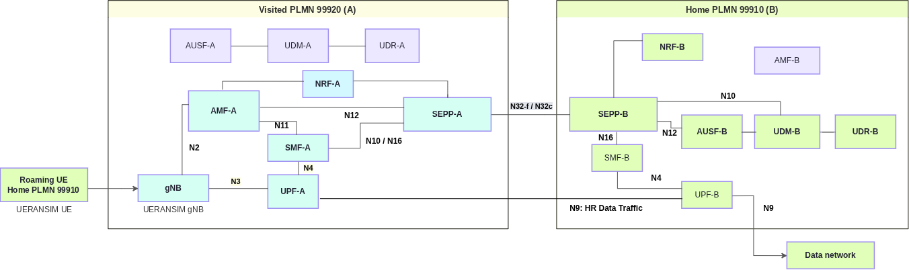

<!-- SPDX-License-Identifier: CC-BY-4.0 -->

<table style="border-collapse: collapse; border: none;">
  <tr style="border-collapse: collapse; border: none;">
    <td style="border-collapse: collapse; border: none;">
      <a href="http://www.openairinterface.org/">
         
         </img>
      </a>
    </td>
    <td style="border-collapse: collapse; border: none; vertical-align: center;">
      <b><font size = "5">OpenAirInterface 5G Core Network Home Routed Roaming Deployment using Docker Compose</font></b>
    </td>
  </tr>
</table>

# Home Routed Roaming

This tutorial illustrates the **Home Routed (HR) roaming** case: a UE from the **home PLMN 999/10** connects to the **visited PLMN 999/20**, and its PDU session is anchored in the home network. It covers the 5G roaming signalling and user-plane procedures of an HR connection (3GPP TS 23.501 clause 4.2.4, 3GPP TS 23.502 clause 4.3.2.2.2):

- **Inter-PLMN communication through the SEPPs** over N32 (3GPP TS 29.573).
- **UE authentication and subscription retrieval from the home network**: the visited AMF discovers the home AUSF and UDM through the NRFs and the SEPPs.
- **PDU session establishment over N16**: the visited V-SMF creates the session on the home H-SMF through the SEPPs (`Nsmf_PDUSession_Create`, 3GPP TS 29.502), and the H-SMF allocates the UE address from the home pool.
- **Home routed user plane**: the visited V-UPF tunnels the UE traffic over N9 to the home H-UPF, which carries it to the data network on N6.
- **PDU session release over N16** when the UE deregisters (`Nsmf_PDUSession_Release`).

The RAN is simulated: [UERANSIM](https://github.com/aligungr/UERANSIM) provides both the gNB of the visited PLMN and the roaming UE, built from a [fork with roaming PLMN selection](https://github.com/rohanrkharade/UERANSIM) (section 2). No radio hardware is needed.



The [local breakout roaming tutorial](./DEPLOY_SA5G_LBO_ROAMING.md) uses the same two networks, SEPPs and subscriber. Only the home subscription and the session anchoring differ:

| | Local breakout | Home routed |
| - | -------------- | ----------- |
| `lboRoamingAllowed` for DNN `oai` in 999/20 | `true` | `false` |
| SMF(s) | Visited SMF only | V-SMF + H-SMF, N16 through the SEPPs |
| UE address | Visited pool `12.1.1.128/25` | Home pool `12.2.1.128/25` |
| N6 breakout | Visited UPF | Home UPF, via N9 |

## At A Glance

| Item | Value |
| ---- | ----- |
| Goal | Register a roaming UE in the visited PLMN and validate HR user-plane traffic and N16 session release |
| Home → visited PLMN | 999/10 → 999/20 |
| RAN and UE | Simulated with UERANSIM: gNB in PLMN 999/20, UE `imsi-999100000000031` from PLMN 999/10 |
| UE subscription | `imsi-999100000000031`, DNN `oai`, S-NSSAI SST 222 / SD 00007B |
| Home subscription | `lboRoamingAllowed: false` for DNN `oai` in 999/20 |
| UE address pool | `12.2.1.128/25` (H-SMF) |
| Working directory | `oai-cn5g-fed/docker-compose` |
| Core compose file | `docker-compose-basic-nrf-hr-roaming.yaml` |
| Partner configurations | `conf/roaming/roaming_config_partnerA.yaml` (visited), `conf/roaming/roaming_config_partnerB.yaml` (home) |
| UERANSIM configuration | `conf/roaming/ueransim/gnb-plmnA.yaml`, `conf/roaming/ueransim/ue-plmnB.yaml` |
| Subscription databases | `database/roaming/oai_roaming_db_A.sql`, `database/roaming/oai_roaming_db_B.sql` + `database/roaming/hr_roaming_subscription_B.sql` |
| Image build helper | `build_roaming_images.sh` |
| N9 helper | `setup_n9_routing.py` |
| Result folder used below | `/tmp/oai/hr-roaming` |

**Reading time**: ~25 minutes

**Replication time**: ~3-4 hours, mostly building the roaming images; ~15 minutes once the images exist.

**Compute resource recommendation**: ~8 GB RAM and 4 CPUs to build the images; ~4 GB RAM to run the scenario.

**TABLE OF CONTENTS**

1. [Pre-Requisites](#1-pre-requisites)
2. [Build Required NF Images](#2-build-required-nf-images)
3. [Deploy The Two PLMNs](#3-deploy-the-two-plmns)
4. [Run And Verify](#4-run-and-verify)
5. [Release The Session Over N16](#5-release-the-session-over-n16)
6. [Logs And HR Test Capture](#6-logs-and-hr-test-capture)
7. [Limitations](#7-limitations)
8. [Cleanup](#8-cleanup)
9. [Troubleshooting](#9-troubleshooting)
10. [Report An Issue](#10-report-an-issue)

## 1. Pre-Requisites

Complete the [deployment pre-requisites](./DEPLOY_PRE_REQUISITES.md) before starting. This lab also needs Git, the Docker `buildx` plugin (BuildKit) for the image build helper, and Python 3 with PyYAML for the capture, log and N9 helpers; the helpers stop with an installation hint if one is missing. The commands below use `docker-compose`; replace it with `docker compose` if your host only has Compose v2.

All commands below run from the `docker-compose` folder. Create the result folder:

``` shell
docker-compose-host $: rm -rf /tmp/oai/hr-roaming && mkdir -p /tmp/oai/hr-roaming && chmod 777 /tmp/oai/hr-roaming
```

The certificates under `conf/roaming/certs` are lab fixtures for the N32 connection between the SEPPs. Do not use them outside this lab.

## 2. Build Required NF Images

Only the components with roaming changes not yet in `develop` are built. AUSF has no roaming changes: no need to build it, the compose file uses the official `oaisoftwarealliance/oai-ausf:develop` image from Docker Hub.

| Component | Branch | Image |
| --------- | ------ | ----- |
| NRF, UDR, UDM | `lbo-roaming-support` branch | `oai-<nf>:roaming-hr` |
| AMF, SMF, UPF | `hr-roaming-support` branch | `oai-<nf>:roaming-hr` |
| SEPP | `entrypoint-runtime-config` branch (no Docker Hub image) | `oai-sepp:roaming-hr` |
| UERANSIM | [UERANSIM with roaming PLMN selection](https://github.com/rohanrkharade/UERANSIM) | `ueransim:roaming-lbo` |

The UPF is built here, unlike in the LBO lab, because the N9 forwarding rules of the V-UPF and H-UPF are on `hr-roaming-support`. UERANSIM is the same image as in the LBO lab.

The [build helper](../docker-compose/build_roaming_images.sh) selects the HR branches with `IMAGE_TAG=roaming-hr`. It pulls the Docker Hub image, checks that every branch exists, builds the network functions and then UERANSIM, and writes a manifest of the built commits under `.roaming-build/` at the repository root:

``` shell
docker-compose-host $: IMAGE_TAG=roaming-hr ./build_roaming_images.sh
```

To see the selection without building, run it with `--plan`, or with `--check` to also verify that every branch exists.

On a host with limited free memory, limit the parallel compilation, e.g. to four CPUs, with `BUILD_CPUSET=0-3 IMAGE_TAG=roaming-hr ./build_roaming_images.sh`. The helper then uses a dedicated BuildKit builder pinned to those CPUs. An image that was already built from the same commit is reused.

## 3. Deploy The Two PLMNs

Stop the [LBO scenario](./DEPLOY_SA5G_LBO_ROAMING.md) first if it is running: both compose files use the same container and network names. The HR scenario has its own MySQL volumes.

The scenario uses three Docker networks:

| Network | Bridge | Subnet | Used by |
| ------- | ------ | ------ | ------- |
| `oai-public-netA` | `cn5g-partnerA` | `192.168.71.0/24` | Visited PLMN 999/20: NFs, gNB and UE |
| `oai-public-roam` | `cn5g-roam` | `192.168.72.0/24` | N32 between the visited and home SEPPs, N9 between the V-UPF and the H-UPF (inter-PLMN) |
| `oai-public-netB` | `cn5g-partnerB` | `192.168.73.0/24` | Home PLMN 999/10: NFs |

**Step 1: start the capture, deploy and connect the UPFs for N9.** The [capture helper](../docker-compose/capture_roaming_pcap.py) waits for the three bridges to appear, captures on them for 240 seconds and merges the traffic into one pcap file. It runs `tcpdump` from the NRF image of the scenario on the host network, so no host `tcpdump` is needed. Run the N9 helper right after the deployment, before the UE starts (see section 4):

``` shell
docker-compose-host $: python3 capture_roaming_pcap.py --compose docker-compose-basic-nrf-hr-roaming.yaml --output /tmp/oai/hr-roaming/hr-roaming.pcap > /tmp/oai/hr-roaming/pcap.log 2>&1 &
docker-compose-host $: docker-compose -f docker-compose-basic-nrf-hr-roaming.yaml up -d
docker-compose-host $: python3 setup_n9_routing.py --compose docker-compose-basic-nrf-hr-roaming.yaml | tee /tmp/oai/hr-roaming/n9-routing.txt
```

Each UPF keeps its N3, N4 and N6 interfaces in its own PLMN. The [N9 helper](../docker-compose/setup_n9_routing.py) attaches the V-UPF and the H-UPF to the inter-PLMN network, at the addresses given by the `org.openairinterface.n9.ipv4` labels in the compose file, and routes the GTP-U address of each UPF through the other's inter-PLMN address. The N9 tunnel therefore crosses `cn5g-roam`, as it would cross an IPX network between operators:

<!-- excerpt:n9-routing -->
```console
oai-upf-A: connected to oai-public-roam as 192.168.72.139
oai-upf-B: connected to oai-public-roam as 192.168.72.239
oai-upf-A: N9 to oai-upf-B GTP-U 192.168.73.139 via 192.168.72.239
oai-upf-B: N9 to oai-upf-A GTP-U 192.168.71.139 via 192.168.72.139
```
<!-- /excerpt -->

**Step 2: check that all NFs are healthy** before running the UE test of section 4. Repeat the command until every NF shows `Up (healthy)`; MySQL and the UE container show `Up`:

``` shell
docker-compose-host $: docker-compose -f docker-compose-basic-nrf-hr-roaming.yaml ps
```

<!-- excerpt:nf-health -->
```console
Name                                     State
amf.5gc.mnc10.mcc999.3gppnetwork.org     Up (healthy)
amf.5gc.mnc20.mcc999.3gppnetwork.org     Up (healthy)
ausf.5gc.mnc10.mcc999.3gppnetwork.org    Up (healthy)
ausf.5gc.mnc20.mcc999.3gppnetwork.org    Up (healthy)
mysql-A                                  Up
mysql-B                                  Up
nrf.5gc.mnc10.mcc999.3gppnetwork.org     Up (healthy)
nrf.5gc.mnc20.mcc999.3gppnetwork.org     Up (healthy)
sepp.5gc.mnc10.mcc999.3gppnetwork.org    Up (healthy)
sepp.5gc.mnc20.mcc999.3gppnetwork.org    Up (healthy)
smf.5gc.mnc10.mcc999.3gppnetwork.org     Up (healthy)
smf.5gc.mnc20.mcc999.3gppnetwork.org     Up (healthy)
udm.5gc.mnc10.mcc999.3gppnetwork.org     Up (healthy)
udm.5gc.mnc20.mcc999.3gppnetwork.org     Up (healthy)
udr.5gc.mnc10.mcc999.3gppnetwork.org     Up (healthy)
udr.5gc.mnc20.mcc999.3gppnetwork.org     Up (healthy)
ue-plmnB-roaming-A                       Up
upf.5gc.mnc10.mcc999.3gppnetwork.org     Up (healthy)
upf.5gc.mnc20.mcc999.3gppnetwork.org     Up (healthy)
```
<!-- /excerpt -->

Each SEPP has its SBI interface in its own PLMN and its N32 interface on `oai-public-roam`. At start-up, the SEPP container detects which interface is which and runs with a copy of its configuration; the mounted partner configuration is read-only and stays unchanged. The containers of the visited PLMN use the `mnc20` FQDNs and those of the home PLMN the `mnc10` FQDNs.

## 4. Run And Verify

The `ue-plmnB-roaming-A` container waits 50 seconds for the core, starts the visited gNB (PLMN 999/20) and the UE, and pings `google.com` through the UE tunnel interface once the PDU session is up. The UE selects the visited PLMN, registers and establishes its home routed PDU session:

``` shell
docker-compose-host $: docker logs ue-plmnB-roaming-A > /tmp/oai/hr-roaming/ueransim.log 2>&1
docker-compose-host $: grep -E 'Selected plmn|Registration is successful|establishment is successful|TUN interface' /tmp/oai/hr-roaming/ueransim.log
```

<!-- excerpt:ue-registration -->
```console
[2026-10-03 13:01:51.214] [nas] [info] Selected plmn[999/20] (home plmn[999/10])
[2026-10-03 13:01:51.411] [nas] [info] Initial Registration is successful
[2026-10-03 13:01:51.785] [nas] [info] PDU Session establishment is successful PSI[1]
[2026-10-03 13:01:51.839] [app] [info] Connection setup for PDU session[1] is successful, TUN interface[uesimtun0, 12.2.1.130] is up.
[2026-10-03 13:02:12.382] [nas] [info] Initial Registration is successful
[2026-10-03 13:02:12.726] [nas] [info] PDU Session establishment is successful PSI[1]
[2026-10-03 13:02:12.773] [app] [info] Connection setup for PDU session[1] is successful, TUN interface[uesimtun0, 12.2.1.130] is up.
```
<!-- /excerpt -->

If the N9 helper ran after the UE started, the automatic ping fails. Run the helper, then restart the UE with `docker-compose -f docker-compose-basic-nrf-hr-roaming.yaml restart ueransim-vplmnA`.

Check the UE state and PDU session with the UERANSIM CLI:

``` shell
docker-compose-host $: SUPI=$(sed -n 's/^supi: //p' conf/roaming/ueransim/ue-plmnB.yaml)
docker-compose-host $: docker exec ue-plmnB-roaming-A nr-cli "$SUPI" -e status
docker-compose-host $: docker exec ue-plmnB-roaming-A nr-cli "$SUPI" -e ps-list
```

<!-- excerpt:ue-status -->
```console
cm-state: CM-CONNECTED
rm-state: RM-REGISTERED
selected-plmn: 999/20
hplmn: 999/10
roaming: true
current-plmn: 999/20
```
<!-- /excerpt -->

<!-- excerpt:ue-ps-list -->
```console
PDU Session1:
 state: PS-ACTIVE
 session-type: IPv4
 apn: oai
 s-nssai:
  sst: 0xde
  sd: 0x00007b
 emergency: false
 address: 12.2.1.130
 ambr: up[1Mb/s] down[1Mb/s]
 data-pending: false
```
<!-- /excerpt -->

Confirm `roaming: true`, an active IPv4 PDU session on DNN `oai`, and a UE address from the **home** pool `12.2.1.128/25`. Then generate traffic from the UE tunnel interface:

``` shell
docker-compose-host $: docker exec ue-plmnB-roaming-A ping -c 3 -I uesimtun0 google.com
```

<!-- excerpt:ue-ping -->
```console
PING google.com (108.177.119.101) from 12.2.1.130 uesimtun0: 56(84) bytes of data.
64 bytes from ei-in-f101.1e100.net (108.177.119.101): icmp_seq=1 ttl=105 time=30.6 ms
64 bytes from ei-in-f101.1e100.net (108.177.119.101): icmp_seq=2 ttl=105 time=28.4 ms
64 bytes from ei-in-f101.1e100.net (108.177.119.101): icmp_seq=3 ttl=105 time=26.6 ms

--- google.com ping statistics ---
3 packets transmitted, 3 received, 0% packet loss, time 2002ms
rtt min/avg/max/mdev = 26.572/28.517/30.561/1.630 ms
```
<!-- /excerpt -->

The UE address and the destination address can differ in your run.

## 5. Release The Session Over N16

Deregister the UE to exercise the N16 release. The V-SMF releases the session on the H-SMF through the SEPPs; the UE then registers again by itself and gets a new home routed session:

``` shell
docker-compose-host $: docker exec ue-plmnB-roaming-A nr-cli "$SUPI" -e "deregister normal"
docker-compose-host $: docker exec ue-plmnB-roaming-A nr-cli "$SUPI" -e ps-list
```

Once `ps-list` shows `PS-ACTIVE` again, repeat the ping:

``` shell
docker-compose-host $: docker exec ue-plmnB-roaming-A ping -c 3 -I uesimtun0 google.com
```

<!-- excerpt:ue-ps-list-after -->
```console
PDU Session1:
 state: PS-ACTIVE
 session-type: IPv4
 apn: oai
 s-nssai:
  sst: 0xde
  sd: 0x00007b
 emergency: false
 address: 12.2.1.130
 ambr: up[1Mb/s] down[1Mb/s]
 data-pending: false
```
<!-- /excerpt -->

<!-- excerpt:ue-ping-after -->
```console
PING google.com (108.177.119.102) from 12.2.1.130 uesimtun0: 56(84) bytes of data.
64 bytes from ei-in-f102.1e100.net (108.177.119.102): icmp_seq=1 ttl=105 time=23.3 ms
64 bytes from ei-in-f102.1e100.net (108.177.119.102): icmp_seq=2 ttl=105 time=22.8 ms
64 bytes from ei-in-f102.1e100.net (108.177.119.102): icmp_seq=3 ttl=105 time=24.9 ms

--- google.com ping statistics ---
3 packets transmitted, 3 received, 0% packet loss, time 2003ms
rtt min/avg/max/mdev = 22.764/23.643/24.904/0.914 ms
```
<!-- /excerpt -->

The new session can use a different UE address and different TEIDs.

## 6. Logs And HR Test Capture

Collect the logs of every container, including all NFs of both PLMNs:

``` shell
docker-compose-host $: python3 capture_roaming_logs.py --compose docker-compose-basic-nrf-hr-roaming.yaml --output /tmp/oai/hr-roaming/logs
```

The packet capture started in section 3 stops by itself after 240 seconds and writes `/tmp/oai/hr-roaming/hr-roaming.pcap`. To also capture the release of section 5, run that section within this time or start the capture with a larger `--seconds`. Debug logs and captures contain subscriber authentication material of the lab subscriber; share only redacted excerpts of other subscribers.

Selected excerpts from the same run follow. The Docker timestamp prefix is removed; each line keeps the NF's own timestamp. The logs cover both sessions, before and after the deregistration of section 5.

**Visited SEPP: N32-c handshake with the home SEPP** (3GPP TS 29.573 clause 5.2). The SEPPs agree on PRINS as N32-f security, then exchange the JWE and JWS ciphers and the N32-f context ID:

<!-- excerpt:sepp-n32-visited -->
```console
[2026-10-03 15:00:54.891] [sepp_app] [info] Creating N32-c capability exchange request via model
[2026-10-03 15:00:54.891] [sepp_app] [info] Initiating N32-c capability exchange with peer SEPP: http://sepp.5gc.mnc10.mcc999.3gppnetwork.org:8080/n32c-handshake/v1/exchange-capability
[2026-10-03 15:00:54.941] [sepp_client] [debug] Send a simple HTTP request
[2026-10-03 15:00:54.942] [sepp_app] [info] Received HTTP response with status code: 200
[2026-10-03 15:00:54.942] [sepp_app] [info] Processing N32-c capability exchange response
[2026-10-03 15:00:54.942] [sepp_app] [info] Capability exchange response from peer SEPP: sepp.5gc.mnc10.mcc999.3gppnetwork.org
[2026-10-03 15:00:54.942] [sepp_app] [info] Peer SEPP confirmed 3GppSbiTargetApiRootSupported: true
[2026-10-03 15:00:54.942] [sepp_app] [info] Selected Security Capability: PRINS
[2026-10-03 15:00:54.942] [sepp_app] [info] N32-c capability exchange succeeded with http://sepp.5gc.mnc10.mcc999.3gppnetwork.org:8080/n32c-handshake/v1/exchange-capability
[2026-10-03 15:00:54.943] [sepp_app] [info] Security capability is PRINS. Performing Parameter Exchange...
[2026-10-03 15:00:54.943] [sepp_app] [info] Creating SecParamExchReqData via OpenAPI model
[2026-10-03 15:00:54.943] [sepp_app] [info] Initiating N32-c parameter exchange with http://sepp.5gc.mnc10.mcc999.3gppnetwork.org:8080/n32c-handshake/v1/exchange-params
[2026-10-03 15:00:54.943] [sepp_client] [debug] Send a simple HTTP request
[2026-10-03 15:00:54.944] [sepp_app] [info] Parameter exchange status code: 200
[2026-10-03 15:00:54.944] [sepp_app] [info] Processing N32-c parameter exchange response using model
[2026-10-03 15:00:54.944] [sepp_app] [info] Context ID established: 579dc3e3-a1ed-4e90-bd50-6f91880ed871
[2026-10-03 15:00:54.944] [sepp_app] [info] Negotiated JWE cipher: A128GCM
[2026-10-03 15:00:54.944] [sepp_app] [info] Negotiated JWS cipher: ES256
[2026-10-03 15:00:54.944] [sepp_app] [info] N32-c Parameter Exchange successfully established
```
<!-- /excerpt -->

**Home SEPP: the same handshake from the responding side**

<!-- excerpt:sepp-n32-home -->
```console
[2026-10-03 15:00:54.942] [sepp_app] [info] Processing N32-c capability exchange request
[2026-10-03 15:00:54.942] [sepp_app] [info] Peer indicated 3GppSbiTargetApiRootSupported: true
[2026-10-03 15:00:54.942] [sepp_app] [info] Received capability exchange request from peer SEPP: sepp.5gc.mnc20.mcc999.3gppnetwork.org
[2026-10-03 15:00:54.942] [sepp_app] [info] Successfully processed N32-c capability exchange (Selected Security: PRINS, Purpose: ROAMING, TargetApiRoot: true)
[2026-10-03 15:00:54.944] [sepp_app] [info] Handling N32-c parameter exchange request using model
[2026-10-03 15:00:54.944] [sepp_app] [info] Processed N32-c parameter exchange. N32F Context ID: 579dc3e3-a1ed-4e90-bd50-6f91880ed871, JWE: A128GCM, JWS: ES256
```
<!-- /excerpt -->

**N32-f message protected with JOSE: authentication request of the visited AMF to the home AUSF** (PRINS, 3GPP TS 29.573 clause 5.3, 3GPP TS 33.501 clause 13.2). The visited SEPP receives the `nausf-auth` request of the visited AMF, protects it with the negotiated JWE/JWS ciphers and sends it over N32-f; it decrypts the protected response of the home SEPP before answering the AMF. The N16 requests between the V-SMF and the H-SMF cross the SEPPs in the same way:

<!-- excerpt:sepp-jose-visited -->
```console
[2026-10-03 15:01:51.251] [sepp_app] [info] Forwarding NF service request: authority=ausf.5gc.mnc10.mcc999.3gppnetwork.org:8080, path=/nausf-auth/v1/ue-authentications, method=POST
[2026-10-03 15:01:51.251] [sepp_client] [debug] Send a simple HTTP request
[2026-10-03 15:01:51.316] [sepp_app] [info] PRINS: Received HTTP response status: 200
[2026-10-03 15:01:51.316] [sepp_app] [debug] PRINS: Decrypted JOSE response: {"5gAuthData":{"autn":"5b2a8246ec3680001223e59c2d71d932","hxresStar":"07cb8761bd446563eb385f1718c3fb98","rand":"ee1b762e8d935f9643016c37c3814043"},"_links":{"5g-aka":{"href":"http://192.168.73.133:8080/nausf-auth/v1/ue-authentications/5b2a8246ec3680001223e59c2d71d932/5g-aka-confirmation"}},"authType":"5G_AKA"}
```
<!-- /excerpt -->

The home SEPP decrypts the JOSE payload, sends the request to the home AUSF and protects the response for the way back:

<!-- excerpt:sepp-jose-home -->
```console
[2026-10-03 15:01:51.255] [sepp_app] [info] Decrypted JOSE incoming payload: {"servingNetworkName":"5G:mnc020.mcc999.3gppnetwork.org","supiOrSuci":"imsi-999100000000031"}
[2026-10-03 15:01:51.255] [sepp_app] [info] Sending local HTTP request to target NF: http://ausf.5gc.mnc10.mcc999.3gppnetwork.org:8080/nausf-auth/v1/ue-authentications
[2026-10-03 15:01:51.255] [sepp_app] [info] Prepared local NF HTTP request: HTTP Request to URI: http://ausf.5gc.mnc10.mcc999.3gppnetwork.org:8080/nausf-auth/v1/ue-authentications
[2026-10-03 15:01:51.255] [sepp_client] [debug] Send a simple HTTP request
[2026-10-03 15:01:51.315] [sepp_app] [info] Received local NF HTTP response with status code: 201
```
<!-- /excerpt -->

**Home AUSF: authentication of the roaming UE** (5G AKA, 3GPP TS 33.501 clause 6.1.3.2), main lines:

<!-- excerpt:ausf-auth -->
```console
[2026-10-03 15:01:51.258] [ausf_app] [info] supiOrSuci imsi-999100000000031
[2026-10-03 15:01:51.259] [ausf_app] [info] Received authInfo from AMF without ResynchronizationInfo IE
[2026-10-03 15:01:51.314] [ausf_server] [info] Send Auth response to SEAF (Code 201)
[2026-10-03 15:01:51.329] [ausf_server] [info] Received 5g_aka_confirmation Request
[2026-10-03 15:01:51.329] [ausf_app] [info] Received res* D9887E288884A747617EA63ECC38002E
[2026-10-03 15:01:51.329] [ausf_app] [info] Authentication successful by home network!
[2026-10-03 15:01:51.353] [ausf_server] [info] Send 5g-aka-confirmation response to SEAF (Code 200)
[2026-10-03 15:02:12.266] [ausf_app] [info] supiOrSuci imsi-999100000000031
[2026-10-03 15:02:12.267] [ausf_app] [info] Received authInfo from AMF without ResynchronizationInfo IE
[2026-10-03 15:02:12.291] [ausf_server] [info] Send Auth response to SEAF (Code 201)
[2026-10-03 15:02:12.307] [ausf_server] [info] Received 5g_aka_confirmation Request
[2026-10-03 15:02:12.307] [ausf_app] [info] Received res* 4D5C53214BCDF97090E38C3D4B380177
[2026-10-03 15:02:12.307] [ausf_app] [info] Authentication successful by home network!
[2026-10-03 15:02:12.327] [ausf_server] [info] Send 5g-aka-confirmation response to SEAF (Code 200)
```
<!-- /excerpt -->

**Visited AMF: the UE is registered in PLMN 999,20 through the visited gNB**

<!-- excerpt:amf-ues -->
```console
[2026-10-03 15:04:55.288] [amf_app] [info]
   |------------------------------------------------------------------------------------------------------------------------------------------------------------|
   |----------------------------------------------------------------------gNBs' Information---------------------------------------------------------------------|
   |  Index |               Status               |              Global Id             |              gNB Name              |                PLMN                |
   |    1   |              Connected             |                0x01                |        UERANSIM-gnb-999-20-1       |               999,20               |
   |------------------------------------------------------------------------------------------------------------------------------------------------------------|

   |-----------------------------------------------------------------------------------------------------------------------------------------------------------|
   |---------------------------------------------------------------------UEs' Information----------------------------------------------------------------------|
   |  Index |     5GMM State     |                IMSI/SUPI               |        GUTI        |   RAN UE NGAP ID   |   AMF UE NGAP ID   |        PLMN        |       Cell Id      |
   |    1   |   5GMM-REGISTERED  |             999100000000031            |99920010041266622955|        0x02        |        0x02        |       999,20       |      000000010     |
   |-----------------------------------------------------------------------------------------------------------------------------------------------------------|
```
<!-- /excerpt -->

**V-SMF: session creation on the H-SMF over N16** (`Nsmf_PDUSession_Create`, 3GPP TS 23.502 clause 4.3.2.2.2, 3GPP TS 29.502). The V-SMF first establishes the N4 session with the V-UPF, which allocates the N9 F-TEID (step 5). The V-SMF sends that F-TEID to the H-SMF and receives the UE address, the H-UPF N9 F-TEID and the authorized QoS; it then gives the V-UPF the uplink rules towards the H-UPF in an N4 Session Modification (step 13a):

<!-- excerpt:smf-visited-n16 -->
```console
[2026-10-03 15:01:51.708] [smf_app] [info] Home-routed PDU session: Nsmf_PDUSession_Create to H-SMF http://smf.5gc.mnc10.mcc999.3gppnetwork.org:8080/nsmf-pdusession/v1, V-UPF N9 F-TEID ID 0x2 - IP: 192.168.71.139
[2026-10-03 15:01:51.708] [smf_sbi] [info] Send inter-PLMN request to http://smf.5gc.mnc10.mcc999.3gppnetwork.org:8080 via local SEPP http://sepp.5gc.mnc20.mcc999.3gppnetwork.org:8080
[2026-10-03 15:01:51.708] [smf_sbi] [debug] Request body: {"anType":"3GPP_ACCESS","dnn":"oai","pduSessionId":1,"ratType":"NR","requestType":"INITIAL_REQUEST","sNssai":{"sd":"00007b","sst":222},"servingNetwork":{"mcc":"999","mnc":"20"},"supi":"imsi-999100000000031","vcnTunnelInfo":{"gtpTeid":"00000002","ipv4Addr":"192.168.71.139"},"vsmfId":"3248f41a-e68d-4603-81b1-4473107442bc","vsmfPduSessionUri":"http://smf.5gc.mnc20.mcc999.3gppnetwork.org:8080/nsmf-pdusession/v1/vsmf-pdu-sessions/1"}
[2026-10-03 15:01:51.708] [smf_sbi] [debug] Send a simple HTTP request
[2026-10-03 15:01:51.759] [smf_sbi] [debug] Response code 201, body: {"hSmfInstanceId":"9c43664a-2a40-4707-8fda-105aa4816aa5","hcnTunnelInfo":{"gtpTeid":"00000001","ipv4Addr":"192.168.73.139"},"pduSessionId":1,"pduSessionType":"IPV4","qosFlowsSetupList":[{"qfi":1,"qosFlowProfile":{"5qi":6,"arp":{"preemptCap":"NOT_PREEMPT","preemptVuln":"NOT_PREEMPTABLE","priorityLevel":1}}}],"sNssai":{"sd":"00007b","sst":222},"sessionAmbr":{"downlink":"100Mbps","uplink":"100Mbps"},"sscMode":"SSC_MODE_1","ueIpv4Address":"12.2.1.130"}
[2026-10-03 15:01:51.760] [smf_app] [info] Find DNN configuration with DNN oai
[2026-10-03 15:01:51.760] [smf_app] [info] Inserted DNN Subscription, key: 31710 dnn oai
 - snssai:
  + sst........................................: 222
  + sd.........................................: 00007b

[2026-10-03 15:01:51.760] [smf_app] [info] Home-routed PDU session created on the H-SMF: http://smf.5gc.mnc10.mcc999.3gppnetwork.org:8080/nsmf-pdusession/v1/pdu-sessions/1, UE IPv4 12.2.1.130, H-UPF N9 F-TEID ID 0x1 - IP: 192.168.73.139, Session AMBR UL 100Mbps DL 100Mbps, 5QI 6
```
<!-- /excerpt -->

**H-SMF: the N16 request of the V-SMF and the UE address from the home pool**

<!-- excerpt:smf-home-n16 -->
```console
[2026-10-03 15:01:51.717] [smf_app] [info] Handle Nsmf_PDUSession_Create from V-SMF (home-routed PDU session), SUPI imsi-999100000000031, PDU Session ID 1, DNN oai, serving PLMN 99920, V-UPF N9 TEID 0x2 IP 192.168.71.139
[2026-10-03 15:01:51.717] [smf_app] [debug] Requested DNN: oai
[2026-10-03 15:01:51.717] [smf_app] [debug] DNN label: , dnn: default
[2026-10-03 15:01:51.717] [smf_app] [debug] DNN label: , dnn: ims
[2026-10-03 15:01:51.717] [smf_app] [debug] DNN label: , dnn: oai
[2026-10-03 15:01:51.717] [smf_app] [debug] DNN matched!
[2026-10-03 15:01:51.717] [smf_app] [debug] PDU Session Type 1, PDN Type 1
[2026-10-03 15:01:51.718] [smf_app] [debug] Promise ID generated 9
[2026-10-03 15:01:51.718] [smf_sbi] [debug] UDM's URL: http://udm.5gc.mnc10.mcc999.3gppnetwork.org:8080/nudm-sdm/v1/imsi-999100000000031/sm-data?single-nssai={"sst":222,"sd":"00007b"}&dnn=oai&plmn-id={"mcc":"999","mnc":"20"}
[2026-10-03 15:01:51.718] [smf_sbi] [debug] Send a simple HTTP request
[2026-10-03 15:01:51.743] [smf_sbi] [debug] Response data [{"dnnConfigurations":{"oai":{"5gQosProfile":{"5qi":6,"arp":{"preemptCap":"NOT_PREEMPT","preemptVuln":"NOT_PREEMPTABLE","priorityLevel":1},"priorityLevel":1},"pduSessionTypes":{"defaultSessionType":"IPV4"},"sessionAmbr":{"downlink":"100Mbps","uplink":"100Mbps"},"sscModes":{"defaultSscMode":"SSC_MODE_1"}}},"singleNssai":{"sd":"00007b","sst":222}}]
[2026-10-03 15:01:51.743] [smf_sbi] [debug] Session Management Subscription Data Retrieval, response from UDM, HTTP Code: 200
[2026-10-03 15:01:51.743] [smf_sbi] [debug] Got successful response from UDM, URL: http://udm.5gc.mnc10.mcc999.3gppnetwork.org:8080/nudm-sdm/v1/imsi-999100000000031/sm-data?single-nssai={"sst":222,"sd":"00007b"}&dnn=oai&plmn-id={"mcc":"999","mnc":"20"}
[2026-10-03 15:01:51.743] [smf_sbi] [debug] Response from UDM [{"dnnConfigurations":{"oai":{"5gQosProfile":{"5qi":6,"arp":{"preemptCap":"NOT_PREEMPT","preemptVuln":"NOT_PREEMPTABLE","priorityLevel":1},"priorityLevel":1},"pduSessionTypes":{"defaultSessionType":"IPV4"},"sessionAmbr":{"downlink":"100Mbps","uplink":"100Mbps"},"sscModes":{"defaultSscMode":"SSC_MODE_1"}}},"singleNssai":{"sd":"00007b","sst":222}}]
[2026-10-03 15:01:51.743] [smf_app] [debug] Trigger the response from SMF: Set promise with ID 9 to ready
[2026-10-03 15:01:51.743] [smf_app] [debug] Got result for promise ID 9
[2026-10-03 15:01:51.743] [smf_app] [debug] Response from UDM {"dnnConfigurations":{"oai":{"5gQosProfile":{"5qi":6,"arp":{"preemptCap":"NOT_PREEMPT","preemptVuln":"NOT_PREEMPTABLE","priorityLevel":1},"priorityLevel":1},"pduSessionTypes":{"defaultSessionType":"IPV4"},"sessionAmbr":{"downlink":"100Mbps","uplink":"100Mbps"},"sscModes":{"defaultSscMode":"SSC_MODE_1"}}},"singleNssai":{"sd":"00007b","sst":222}}
[2026-10-03 15:01:51.743] [smf_app] [debug] DNN Configurations {"oai":{"5gQosProfile":{"5qi":6,"arp":{"preemptCap":"NOT_PREEMPT","preemptVuln":"NOT_PREEMPTABLE","priorityLevel":1},"priorityLevel":1},"pduSessionTypes":{"defaultSessionType":"IPV4"},"sessionAmbr":{"downlink":"100Mbps","uplink":"100Mbps"},"sscModes":{"defaultSscMode":"SSC_MODE_1"}}}
[2026-10-03 15:01:51.743] [smf_app] [debug] DNN oai
[2026-10-03 15:01:51.743] [smf_app] [debug] Default session type IPV4
[2026-10-03 15:01:51.743] [smf_app] [debug] Default SSC Mode SSC_MODE_1
[2026-10-03 15:01:51.743] [smf_app] [debug] Session AMBR Uplink 100Mbps, Downlink 100Mbps
[2026-10-03 15:01:51.744] [smf_app] [info] Inserted DNN Subscription, key: 31710 dnn oai
 - snssai:
  + sst........................................: 222
  + sd.........................................: 00007b

[2026-10-03 15:01:51.744] [smf_sbi] [debug] Subscribe SDM Subscriptions with the UDM
[2026-10-03 15:01:51.744] [smf_app] [info] Handle a PDU Session Create SM Context Request message from AMF (HTTP version 2)
[2026-10-03 15:01:51.744] [smf_app] [info] Find PDU Session with ID 1
[2026-10-03 15:01:51.744] [smf_app] [debug] Create a new PDU session
[2026-10-03 15:01:51.745] [smf_app] [info] Add PDU Session with Id 1
[2026-10-03 15:01:51.745] [smf_app] [debug] PDU Session Id (1) has been added successfully
[2026-10-03 15:01:51.745] [smf_app] [debug] PCO: Protocol identifier IPCP option DNS Server Request
[2026-10-03 15:01:51.745] [smf_app] [debug] PCO: Protocol identifier IPCP option Link MTU Request
[2026-10-03 15:01:51.745] [smf_app] [debug] UE Address Allocation
[2026-10-03 15:01:51.745] [smf_app] [info] Find a DNN Subscription with key: 31710, map size 1 and
 - snssai:
  + sst........................................: 222
  + sd.........................................: 00007b

[2026-10-03 15:01:51.745] [smf_app] [info] Find DNN configuration with DNN oai
[2026-10-03 15:01:51.745] [smf_app] [debug] PDU Session Type IPv4
[2026-10-03 15:01:51.745] [smf_app] [info] PAA, Ipv4 Address: 12.2.1.130
[2026-10-03 15:01:51.745] [smf_app] [info] Get default QoS for a PDU Session, key 222
[2026-10-03 15:01:51.745] [smf_app] [info] Find a DNN Subscription with key: 31710, map size 1 and
 - snssai:
  + sst........................................: 222
  + sd.........................................: 00007b

[2026-10-03 15:01:51.745] [smf_app] [info] Find DNN configuration with DNN oai
[2026-10-03 15:01:51.745] [smf_app] [debug] Get AMBR info from the subscription information (DNN oai)
[2026-10-03 15:01:51.745] [smf_sbi] [debug] UDM's URI: http://udm.5gc.mnc10.mcc999.3gppnetwork.org:8080/nudm-sdm/v1/imsi-999100000000031/sdm-subscriptions
[2026-10-03 15:01:51.745] [smf_app] [info] Find a DNN Subscription with key: 31710, map size 1 and
 - snssai:
  + sst........................................: 222
  + sd.........................................: 00007b

[2026-10-03 15:01:51.745] [smf_app] [info] Find DNN configuration with DNN oai
[2026-10-03 15:01:51.745] [smf_sbi] [debug] Send a simple HTTP request
[2026-10-03 15:01:51.745] [smf_app] [debug] Set the notification URI http://smf.5gc.mnc10.mcc999.3gppnetwork.org:8080/nsmf-callback/v1/1/sm-policy-control-notify for the PCF to use to notify the SMF of
[2026-10-03 15:01:51.745] [smf_n7 ] [warning] Local PCC rules are not supported yet
[2026-10-03 15:01:51.745] [smf_n7 ] [info] PCF SM Policy Association Creation was not successful. Continue using default rules
[2026-10-03 15:01:51.745] [smf_app] [debug] Send ITTI msg to SMF APP to trigger the response of Server
[2026-10-03 15:01:51.746] [smf_app] [info] Create a procedure to process this message.
[2026-10-03 15:01:51.746] [smf_app] [info] Perform a procedure - Create SM Context Request
[2026-10-03 15:01:51.746] [smf_app] [info] Get default QoS for a PDU Session, key 222
[2026-10-03 15:01:51.746] [smf_app] [info] Find a DNN Subscription with key: 31710, map size 1 and
 - snssai:
  + sst........................................: 222
  + sd.........................................: 00007b

[2026-10-03 15:01:51.746] [smf_app] [info] Find DNN configuration with DNN oai
[2026-10-03 15:01:51.746] [smf_app] [debug] Get AMBR info from the subscription information (DNN oai)
[2026-10-03 15:01:51.746] [smf_app] [info] Find a DNN Subscription with key: 31710, map size 1 and
 - snssai:
  + sst........................................: 222
  + sd.........................................: 00007b

[2026-10-03 15:01:51.746] [smf_app] [info] Find DNN configuration with DNN oai
[2026-10-03 15:01:51.746] [smf_app] [debug] Session AMBR for the QER: ul=100Mbps dl=100Mbps
[2026-10-03 15:01:51.746] [smf_app] [info] Find PDU Session with ID 1
[2026-10-03 15:01:51.746] [smf_app] [debug] UPF selection DFS: Handle UPF upf.5gc.mnc10.mcc999.3gppnetwork.org
[2026-10-03 15:01:51.746] [smf_app] [info] Verifying if UPF edge serves network
[2026-10-03 15:01:51.746] [smf_app] [debug] UPF Edge: - UPF Graph Edge
  + Interface Type.............................: N3
  + NWI........................................:
  + Uplink.....................................: No

[2026-10-03 15:01:51.746] [smf_app] [debug] Selection Criteria: - UPF Selection Criteria
  + snssai:
    - sst......................................: 222
    - sd.......................................: 00007b
  + DNN........................................: oai

[2026-10-03 15:01:51.746] [smf_app] [debug] UPF upf.5gc.mnc10.mcc999.3gppnetwork.org does NOT serve SNSSAI
 - snssai:
  + sst........................................: 222
  + sd.........................................: 00007b

[2026-10-03 15:01:51.746] [smf_app] [debug] UPF upf.5gc.mnc10.mcc999.3gppnetwork.org does NOT serve SNSSAI
 - snssai:
  + sst........................................: 222
  + sd.........................................: 00007b

[2026-10-03 15:01:51.746] [smf_app] [debug] UPF upf.5gc.mnc10.mcc999.3gppnetwork.org serves SNSSAI
 - snssai:
  + sst........................................: 222
  + sd.........................................: 00007b

[2026-10-03 15:01:51.746] [smf_app] [debug] UPF upf.5gc.mnc10.mcc999.3gppnetwork.org does NOT serve DNN oai
[2026-10-03 15:01:51.747] [smf_app] [info] Successfully added UPF node: upf.5gc.mnc10.mcc999.3gppnetwork.org
[2026-10-03 15:01:51.747] [smf_app] [debug] Successfully added UPF graph edge for upf.5gc.mnc10.mcc999.3gppnetwork.org: - UPF Graph Edge
  + Interface Type.............................: N3
  + NWI........................................:
  + Uplink.....................................: No

[2026-10-03 15:01:51.747] [smf_app] [info] Verifying if UPF edge serves network
[2026-10-03 15:01:51.747] [smf_app] [debug] UPF Edge: - UPF Graph Edge
  + Interface Type.............................: N6
  + NWI........................................:
  + Uplink.....................................: No

[2026-10-03 15:01:51.747] [smf_app] [debug] Selection Criteria: - UPF Selection Criteria
  + snssai:
    - sst......................................: 222
    - sd.......................................: 00007b
  + DNN........................................: oai

[2026-10-03 15:01:51.747] [smf_app] [debug] UPF upf.5gc.mnc10.mcc999.3gppnetwork.org does NOT serve SNSSAI
 - snssai:
  + sst........................................: 222
  + sd.........................................: 00007b

[2026-10-03 15:01:51.747] [smf_app] [debug] UPF upf.5gc.mnc10.mcc999.3gppnetwork.org does NOT serve SNSSAI
 - snssai:
  + sst........................................: 222
  + sd.........................................: 00007b

[2026-10-03 15:01:51.747] [smf_app] [debug] UPF upf.5gc.mnc10.mcc999.3gppnetwork.org serves SNSSAI
 - snssai:
  + sst........................................: 222
  + sd.........................................: 00007b

[2026-10-03 15:01:51.747] [smf_app] [debug] UPF upf.5gc.mnc10.mcc999.3gppnetwork.org does NOT serve DNN oai
[2026-10-03 15:01:51.747] [smf_app] [debug] Successfully added UPF graph edge for upf.5gc.mnc10.mcc999.3gppnetwork.org: - UPF Graph Edge
  + Interface Type.............................: N6
  + NWI........................................:
  + Uplink.....................................: Yes

[2026-10-03 15:01:51.747] [smf_app] [info] UPF selection was successful.
[2026-10-03 15:01:51.747] [smf_app] [debug] UPF graph
[2026-10-03 15:01:51.747] [smf_app] [debug]
 - Node.........................................: upf.5gc.mnc10.mcc999.3gppnetwork.org
  + Edges
    - UPF Graph Edge
      + Interface Type.........................: N3
      + NWI....................................:
      + Uplink.................................: No
    - UPF Graph Edge
      + Interface Type.........................: N6
      + NWI....................................:
      + Uplink.................................: Yes

[2026-10-03 15:01:51.747] [smf_app] [debug] DFS Asynch: Handle UPF upf.5gc.mnc10.mcc999.3gppnetwork.org
[2026-10-03 15:01:51.752] [smf_app] [info] Create PDR for FlowInfo:
 {"flowDescription":"permit out ip from any to assigned","flowDirection":"BIDIRECTIONAL","packetFilterUsage":true}
[2026-10-03 15:01:51.752] [smf_app] [debug] Created PDR ID, rule ID 1
[2026-10-03 15:01:51.752] [smf_app] [info] Sending ITTI message 37itti_n4_session_establishment_request to task TASK_SMF_N4
[2026-10-03 15:01:51.754] [smf_n4 ] [info] handle_receive(70 bytes)
[2026-10-03 15:01:51.754] [smf_n4 ] [debug] handle_receive_pfcp_msg msg type 51 length 66
[2026-10-03 15:01:51.754] [smf_app] [debug] Received N4 Session Establishment Response sender teid 0x1  pfcp_tx_id A
[2026-10-03 15:01:51.754] [smf_app] [debug] Handle N4 Session Establishment Response (PDU Session Id 1)
[2026-10-03 15:01:51.754] [smf_app] [debug] Successfully associate PDR 1 with F-TEID ID 0x1 - IP: 192.168.73.139 (QFI: 1)
[2026-10-03 15:01:51.754] [smf_app] [debug] UPF graph in SMF finished
[2026-10-03 15:01:51.755] [smf_n1 ] [debug] Created new QoS rule with ID 1 and 1 packet filters
[2026-10-03 15:01:51.755] [smf_app] [info] Get default QoS for a PDU Session, key 222
[2026-10-03 15:01:51.755] [smf_app] [info] Find a DNN Subscription with key: 31710, map size 1 and
 - snssai:
  + sst........................................: 222
  + sd.........................................: 00007b

[2026-10-03 15:01:51.755] [smf_app] [info] Find DNN configuration with DNN oai
[2026-10-03 15:01:51.755] [smf_app] [debug] Get AMBR info from the subscription information (DNN oai)
[2026-10-03 15:01:51.755] [smf_app] [info] Find a DNN Subscription with key: 31710, map size 1 and
 - snssai:
  + sst........................................: 222
  + sd.........................................: 00007b

[2026-10-03 15:01:51.755] [smf_app] [info] Find DNN configuration with DNN oai
[2026-10-03 15:01:51.755] [smf_app] [info] Home-routed PDU session: reply to the V-SMF, UE IPv4 12.2.1.130, H-UPF N9 F-TEID ID 0x1 - IP: 192.168.73.139, resource http://smf.5gc.mnc10.mcc999.3gppnetwork.org:8080/nsmf-pdusession/v1/pdu-sessions/1
```
<!-- /excerpt -->

<!-- excerpt:smf-home-context -->
```console
[2026-10-03 15:01:51.774] [smf_app] [info] SMF context:

SMF CONTEXT:
SUPI:				imsi-999100000000031
PDU SESSION:
	PDU Session ID:			1
	DNN:			oai
	S-NSSAI:			sst, sd: 222, 00007b
	PDN type:		IPV4
	PAA IPv4:		12.2.1.130
	Default QFI:		No QFI available
	SEID:			1
	N3:
- UPF Graph Edge
  + Interface Type.............................: N3
  + NWI........................................:
  + Uplink.....................................: No
  + PDR ID.....................................: 1
  + FAR ID.....................................: 2


[2026-10-03 15:01:51.775] [smf_app] [debug] Send request to N11 to triger FlexCN, SMF Context ID 0x1
```
<!-- /excerpt -->

**Session release over N16** (`Nsmf_PDUSession_Release`, 3GPP TS 23.502 clause 4.3.4.3), after the deregistration of section 5, on the V-SMF and on the H-SMF:

<!-- excerpt:smf-visited-release -->
```console
[2026-10-03 15:02:02.002] [smf_app] [info] Home-routed PDU session: Nsmf_PDUSession_Release to H-SMF http://smf.5gc.mnc10.mcc999.3gppnetwork.org:8080/nsmf-pdusession/v1/pdu-sessions/1/release
```
<!-- /excerpt -->

<!-- excerpt:smf-home-release -->
```console
[2026-10-03 15:02:02.004] [smf_app] [info] Handle Nsmf_PDUSession_Release from V-SMF, PDU session 1
```
<!-- /excerpt -->

**V-UPF: N4 session establishment and modifications** (3GPP TS 29.244, 3GPP TS 23.502 clause 4.3.2.2.2). In the establishment (step 5) the V-UPF allocates the N9 F-TEID of the downlink PDR (`allocated by UP`) while both FARs drop. The first modification (step 13a) adds the UE address and forwards uplink to the H-UPF over N9; the second (step 19a) forwards downlink to the gNB:

<!-- excerpt:upf-visited -->
```console
[2026-10-03 15:01:51.706] [upf_app] [info] ╔═════════════════════════════════════════════════════════════════════════════╗
[2026-10-03 15:01:51.707] [upf_app] [info] │             Received N4_SESSION_ESTABLISHMENT_REQUEST seid 0x1              │
[2026-10-03 15:01:51.707] [upf_app] [info] ╚═════════════════════════════════════════════════════════════════════════════╝
[2026-10-03 15:01:51.707] [upf_n4 ] [info] pfcp_session::add(far) seid 0x1 FAR=1
[2026-10-03 15:01:51.707] [upf_n4 ] [info]   └─ Adding new FAR 1 to session 0x1
[2026-10-03 15:01:51.707] [upf_n4 ] [debug]      • Apply Action: DROP
[2026-10-03 15:01:51.707] [upf_n4 ] [debug]      • Total FARs in session: 1
[2026-10-03 15:01:51.707] [upf_n4 ] [info] pfcp_session::add(far) seid 0x1 FAR=2
[2026-10-03 15:01:51.707] [upf_n4 ] [info]   └─ Adding new FAR 2 to session 0x1
[2026-10-03 15:01:51.707] [upf_n4 ] [debug]      • Apply Action: DROP
[2026-10-03 15:01:51.707] [upf_n4 ] [debug]      • Total FARs in session: 2
[2026-10-03 15:01:51.707] [upf_n4 ] [info] pfcp_session::set(fteid) seid 0x1
[2026-10-03 15:01:51.707] [upf_n4 ] [info] pfcp_session::get(fteid) seid 0x1
[2026-10-03 15:01:51.707] [upf_n4 ] [info] pfcp_session::add(pdr) seid 0x1 PDR=1
[2026-10-03 15:01:51.707] [upf_n4 ] [info]   └─ Adding new PDR 1 to session 0x1
[2026-10-03 15:01:51.707] [upf_n4 ] [debug]      • Source Interface: ACCESS (Uplink)
[2026-10-03 15:01:51.707] [upf_n4 ] [debug]      • Local F-TEID: 0x1
[2026-10-03 15:01:51.707] [upf_n4 ] [debug]      • Precedence: 4294967295
[2026-10-03 15:01:51.707] [upf_n4 ] [debug]      • Linked FAR: 1
[2026-10-03 15:01:51.707] [upf_n4 ] [debug]      • Linked QER: 1
[2026-10-03 15:01:51.707] [upf_n4 ] [debug]      • Total PDRs in session: 1
[2026-10-03 15:01:51.707] [upf_n4 ] [info] N9 downlink PDR, TEID 0x2 (allocated by UP)
[2026-10-03 15:01:51.707] [upf_n4 ] [info] pfcp_session::add(pdr) seid 0x1 PDR=2
[2026-10-03 15:01:51.707] [upf_n4 ] [info]   └─ Adding new PDR 2 to session 0x1
[2026-10-03 15:01:51.707] [upf_n4 ] [debug]      • Source Interface: CORE (Downlink)
[2026-10-03 15:01:51.707] [upf_n4 ] [debug]      • Local F-TEID: 0x2
[2026-10-03 15:01:51.707] [upf_n4 ] [debug]      • Precedence: 4294967295
[2026-10-03 15:01:51.707] [upf_n4 ] [debug]      • Linked FAR: 2
[2026-10-03 15:01:51.707] [upf_n4 ] [debug]      • Linked QER: 2
[2026-10-03 15:01:51.707] [upf_n4 ] [debug]      • Total PDRs in session: 2
[2026-10-03 15:01:51.707] [upf_app] [debug] Session registered with association smf.5gc.mnc20.mcc999.3gppnetwork.org: cp_fseid seid=0x1 v4=1 addr=0x8a47a8c0

  ┌───────────────────────────────────────────────────────────────────────────────────────────────────────────────────────────────────────────────────────────────────────────────────────────────┐
  │                                                                                PDU SESSION RULES - Session 0x1                                                                                │
  ├────────┬───────┬───────┬───────┬───────┬───────┬────────────┬───────────┬─────────────────┬────────────┬────────────┬───────┬────────────────────────────────┬────────────────────────────────┤
  │  PDR   │  FAR  │  QER  │  URR  │  BAR  │  MAR  │ Precedence │ Direction │    UE IPv4      │   Action   │  Dest If   │  QFI  │       Create Outer Hdr         │       Remove Outer Hdr         │
  ├────────┼───────┼───────┼───────┼───────┼───────┼────────────┼───────────┼─────────────────┼────────────┼────────────┼───────┼────────────────────────────────┼────────────────────────────────┤
  │ 1      │ 1     │ -     │ -     │ -     │ -     │ 4294967295 │ UL        │ -               │ DROP       │ -          │ -     │ -                              │ GTP TEID:0x1                   │
  │ 2      │ 2     │ -     │ -     │ -     │ -     │ 4294967295 │ DL        │ -               │ DROP       │ -          │ -     │ -                              │ GTP TEID:0x2                   │
  └────────┴───────┴───────┴───────┴───────┴───────┴────────────┴───────────┴─────────────────┴────────────┴────────────┴───────┴────────────────────────────────┴────────────────────────────────┘

[2026-10-03 15:01:51.760] [upf_n4 ] [info] handle_receive(284 bytes)
[2026-10-03 15:01:51.761] [upf_app] [info]
[2026-10-03 15:01:51.761] [upf_app] [info] ╔═════════════════════════════════════════════════════════════════════════════╗
[2026-10-03 15:01:51.761] [upf_app] [info] │             Received N4_SESSION_MODIFICATION_REQUEST seid 0x1               │
[2026-10-03 15:01:51.761] [upf_app] [info] ╚═════════════════════════════════════════════════════════════════════════════╝
[2026-10-03 15:01:51.761] [upf_n4 ] [info] pfcp_session::update(pdr) seid 0x1 PDR=2
[2026-10-03 15:01:51.761] [upf_n4 ] [info]   └─ Updating PDR 2 in session 0x1
[2026-10-03 15:01:51.761] [upf_n4 ] [debug]      • Updated PDI
[2026-10-03 15:01:51.761] [upf_n4 ] [info] pfcp_session::update(pdr) seid 0x1 PDR=1
[2026-10-03 15:01:51.761] [upf_n4 ] [info]   └─ Updating PDR 1 in session 0x1
[2026-10-03 15:01:51.761] [upf_n4 ] [debug]      • Updated PDI
[2026-10-03 15:01:51.761] [upf_n4 ] [info] pfcp_session::update(far) seid 0x1 FAR=1
[2026-10-03 15:01:51.761] [upf_n4 ] [info]   └─ Updating FAR 1 in session 0x1
[2026-10-03 15:01:51.761] [upf_n4 ] [debug]      • Apply Action: DROP  → FORW
[2026-10-03 15:01:51.761] [upf_n4 ] [debug]      • Destination: ACCESS → CORE
[2026-10-03 15:01:51.761] [upf_n4 ] [debug]      • Outer Header TEID: 0x0 → 0x1
[2026-10-03 15:01:51.761] [upf_n4 ] [debug]      • New Remote IP: 192.168.73.139

  ┌───────────────────────────────────────────────────────────────────────────────────────────────────────────────────────────────────────────────────────────────────────────────────────────────┐
  │                                                                                PDU SESSION RULES - Session 0x1                                                                                │
  ├────────┬───────┬───────┬───────┬───────┬───────┬────────────┬───────────┬─────────────────┬────────────┬────────────┬───────┬────────────────────────────────┬────────────────────────────────┤
  │  PDR   │  FAR  │  QER  │  URR  │  BAR  │  MAR  │ Precedence │ Direction │    UE IPv4      │   Action   │  Dest If   │  QFI  │       Create Outer Hdr         │       Remove Outer Hdr         │
  ├────────┼───────┼───────┼───────┼───────┼───────┼────────────┼───────────┼─────────────────┼────────────┼────────────┼───────┼────────────────────────────────┼────────────────────────────────┤
  │ 1      │ 1     │ -     │ -     │ -     │ -     │ 4294967295 │ UL        │ 12.2.1.130      │ FORW       │ CORE       │ -     │ GTP → 192.168.73.139:0x1       │ GTP TEID:0x1                   │
  │ 2      │ 2     │ -     │ -     │ -     │ -     │ 4294967295 │ DL        │ 12.2.1.130      │ DROP       │ -          │ -     │ -                              │ GTP TEID:0x2                   │
  └────────┴───────┴───────┴───────┴───────┴───────┴────────────┴───────────┴─────────────────┴────────────┴────────────┴───────┴────────────────────────────────┴────────────────────────────────┘

[2026-10-03 15:01:51.790] [upf_n4 ] [info] handle_receive(78 bytes)
[2026-10-03 15:01:51.790] [upf_app] [info]
[2026-10-03 15:01:51.790] [upf_app] [info] ╔═════════════════════════════════════════════════════════════════════════════╗
[2026-10-03 15:01:51.790] [upf_app] [info] │             Received N4_SESSION_MODIFICATION_REQUEST seid 0x1               │
[2026-10-03 15:01:51.790] [upf_app] [info] ╚═════════════════════════════════════════════════════════════════════════════╝
[2026-10-03 15:01:51.790] [upf_n4 ] [info] pfcp_session::update(far) seid 0x1 FAR=2
[2026-10-03 15:01:51.790] [upf_n4 ] [info]   └─ Updating FAR 2 in session 0x1
[2026-10-03 15:01:51.790] [upf_n4 ] [debug]      • Apply Action: DROP  → FORW
[2026-10-03 15:01:51.790] [upf_n4 ] [debug]      • Outer Header TEID: 0x0 → 0x1
[2026-10-03 15:01:51.790] [upf_n4 ] [debug]      • New Remote IP: 192.168.71.140

  ┌───────────────────────────────────────────────────────────────────────────────────────────────────────────────────────────────────────────────────────────────────────────────────────────────┐
  │                                                                                PDU SESSION RULES - Session 0x1                                                                                │
  ├────────┬───────┬───────┬───────┬───────┬───────┬────────────┬───────────┬─────────────────┬────────────┬────────────┬───────┬────────────────────────────────┬────────────────────────────────┤
  │  PDR   │  FAR  │  QER  │  URR  │  BAR  │  MAR  │ Precedence │ Direction │    UE IPv4      │   Action   │  Dest If   │  QFI  │       Create Outer Hdr         │       Remove Outer Hdr         │
  ├────────┼───────┼───────┼───────┼───────┼───────┼────────────┼───────────┼─────────────────┼────────────┼────────────┼───────┼────────────────────────────────┼────────────────────────────────┤
  │ 1      │ 1     │ -     │ -     │ -     │ -     │ 4294967295 │ UL        │ 12.2.1.130      │ FORW       │ CORE       │ -     │ GTP → 192.168.73.139:0x1       │ GTP TEID:0x1                   │
  │ 2      │ 2     │ -     │ -     │ -     │ -     │ 4294967295 │ DL        │ 12.2.1.130      │ FORW       │ ACCESS     │ -     │ GTP → 192.168.71.140:0x1       │ GTP TEID:0x2                   │
  └────────┴───────┴───────┴───────┴───────┴───────┴────────────┴───────────┴─────────────────┴────────────┴────────────┴───────┴────────────────────────────────┴────────────────────────────────┘
```
<!-- /excerpt -->

**H-UPF: N4 session establishment and the N9 downlink towards the V-UPF**

<!-- excerpt:upf-home -->
```console
[2026-10-03 15:01:51.753] [upf_app] [info] ╔═════════════════════════════════════════════════════════════════════════════╗
[2026-10-03 15:01:51.753] [upf_app] [info] │             Received N4_SESSION_ESTABLISHMENT_REQUEST seid 0x1              │
[2026-10-03 15:01:51.753] [upf_app] [info] ╚═════════════════════════════════════════════════════════════════════════════╝
[2026-10-03 15:01:51.753] [upf_n4 ] [info] pfcp_session::add(far) seid 0x1 FAR=1
[2026-10-03 15:01:51.753] [upf_n4 ] [info]   └─ Adding new FAR 1 to session 0x1
[2026-10-03 15:01:51.753] [upf_n4 ] [debug]      • Apply Action: FORW
[2026-10-03 15:01:51.753] [upf_n4 ] [debug]      • Destination Interface: CORE
[2026-10-03 15:01:51.753] [upf_n4 ] [debug]      • Total FARs in session: 1
[2026-10-03 15:01:51.753] [upf_n4 ] [info] pfcp_session::set(fteid) seid 0x1
[2026-10-03 15:01:51.753] [upf_n4 ] [info] pfcp_session::get(fteid) seid 0x1
[2026-10-03 15:01:51.753] [upf_n4 ] [info] pfcp_session::add(pdr) seid 0x1 PDR=1
[2026-10-03 15:01:51.753] [upf_n4 ] [info]   └─ Adding new PDR 1 to session 0x1
[2026-10-03 15:01:51.753] [upf_n4 ] [debug]      • Source Interface: ACCESS (Uplink)
[2026-10-03 15:01:51.753] [upf_n4 ] [debug]      • Local F-TEID: 0x1
[2026-10-03 15:01:51.753] [upf_n4 ] [debug]      • UE IP Address: 12.2.1.130
[2026-10-03 15:01:51.753] [upf_n4 ] [debug]      • Precedence: 4294967295
[2026-10-03 15:01:51.753] [upf_n4 ] [debug]      • Linked FAR: 1
[2026-10-03 15:01:51.753] [upf_n4 ] [debug]      • Linked QER: 1
[2026-10-03 15:01:51.753] [upf_n4 ] [debug]      • Total PDRs in session: 1
[2026-10-03 15:01:51.753] [upf_app] [debug] Session registered with association smf.5gc.mnc10.mcc999.3gppnetwork.org: cp_fseid seid=0x1 v4=1 addr=0x8a49a8c0

  ┌───────────────────────────────────────────────────────────────────────────────────────────────────────────────────────────────────────────────────────────────────────────────────────────────┐
  │                                                                                PDU SESSION RULES - Session 0x1                                                                                │
  ├────────┬───────┬───────┬───────┬───────┬───────┬────────────┬───────────┬─────────────────┬────────────┬────────────┬───────┬────────────────────────────────┬────────────────────────────────┤
  │  PDR   │  FAR  │  QER  │  URR  │  BAR  │  MAR  │ Precedence │ Direction │    UE IPv4      │   Action   │  Dest If   │  QFI  │       Create Outer Hdr         │       Remove Outer Hdr         │
  ├────────┼───────┼───────┼───────┼───────┼───────┼────────────┼───────────┼─────────────────┼────────────┼────────────┼───────┼────────────────────────────────┼────────────────────────────────┤
  │ 1      │ 1     │ -     │ -     │ -     │ -     │ 4294967295 │ UL        │ 12.2.1.130      │ FORW       │ CORE       │ -     │ -                              │ GTP TEID:0x1                   │
  └────────┴───────┴───────┴───────┴───────┴───────┴────────────┴───────────┴─────────────────┴────────────┴────────────┴───────┴────────────────────────────────┴────────────────────────────────┘

[2026-10-03 15:01:51.757] [upf_n4 ] [info] handle_receive(191 bytes)
[2026-10-03 15:01:51.757] [upf_app] [info]
[2026-10-03 15:01:51.757] [upf_app] [info] ╔═════════════════════════════════════════════════════════════════════════════╗
[2026-10-03 15:01:51.757] [upf_app] [info] │             Received N4_SESSION_MODIFICATION_REQUEST seid 0x1               │
[2026-10-03 15:01:51.757] [upf_app] [info] ╚═════════════════════════════════════════════════════════════════════════════╝
[2026-10-03 15:01:51.757] [upf_n4 ] [info] pfcp_session::add(far) seid 0x1 FAR=2
[2026-10-03 15:01:51.757] [upf_n4 ] [info]   └─ Adding new FAR 2 to session 0x1
[2026-10-03 15:01:51.757] [upf_n4 ] [debug]      • Apply Action: FORW
[2026-10-03 15:01:51.757] [upf_n4 ] [debug]      • Destination Interface: ACCESS
[2026-10-03 15:01:51.757] [upf_n4 ] [debug]      • Outer Header TEID: 0x2
[2026-10-03 15:01:51.757] [upf_n4 ] [debug]      • Remote IP: 192.168.71.139
[2026-10-03 15:01:51.757] [upf_n4 ] [debug]      • Total FARs in session: 2
[2026-10-03 15:01:51.757] [upf_n4 ] [info] pfcp_session::add(pdr) seid 0x1 PDR=2
[2026-10-03 15:01:51.757] [upf_n4 ] [info]   └─ Adding new PDR 2 to session 0x1
[2026-10-03 15:01:51.757] [upf_n4 ] [debug]      • Source Interface: CORE (Downlink)
[2026-10-03 15:01:51.757] [upf_n4 ] [debug]      • UE IP Address: 12.2.1.130
[2026-10-03 15:01:51.757] [upf_n4 ] [debug]      • Precedence: 4294967295
[2026-10-03 15:01:51.757] [upf_n4 ] [debug]      • Linked FAR: 2
[2026-10-03 15:01:51.757] [upf_n4 ] [debug]      • Linked QER: 2
[2026-10-03 15:01:51.757] [upf_n4 ] [debug]      • Total PDRs in session: 2

  ┌───────────────────────────────────────────────────────────────────────────────────────────────────────────────────────────────────────────────────────────────────────────────────────────────┐
  │                                                                                PDU SESSION RULES - Session 0x1                                                                                │
  ├────────┬───────┬───────┬───────┬───────┬───────┬────────────┬───────────┬─────────────────┬────────────┬────────────┬───────┬────────────────────────────────┬────────────────────────────────┤
  │  PDR   │  FAR  │  QER  │  URR  │  BAR  │  MAR  │ Precedence │ Direction │    UE IPv4      │   Action   │  Dest If   │  QFI  │       Create Outer Hdr         │       Remove Outer Hdr         │
  ├────────┼───────┼───────┼───────┼───────┼───────┼────────────┼───────────┼─────────────────┼────────────┼────────────┼───────┼────────────────────────────────┼────────────────────────────────┤
  │ 1      │ 1     │ -     │ -     │ -     │ -     │ 4294967295 │ UL        │ 12.2.1.130      │ FORW       │ CORE       │ -     │ -                              │ GTP TEID:0x1                   │
  │ 2      │ 2     │ -     │ -     │ -     │ -     │ 4294967295 │ DL        │ 12.2.1.130      │ FORW       │ ACCESS     │ -     │ GTP → 192.168.71.139:0x2       │ -                              │
  └────────┴───────┴───────┴───────┴───────┴───────┴────────────┴───────────┴─────────────────┴────────────┴────────────┴───────┴────────────────────────────────┴────────────────────────────────┘
```
<!-- /excerpt -->

The V-UPF removes the N3 GTP-U header of uplink packets and re-encapsulates them in GTP-U towards the H-UPF on N9; it receives the downlink on its N9 TEID and encapsulates it towards the gNB on N3. The H-UPF removes the N9 header of uplink packets and sends them to the data network (`CORE`), and encapsulates the replies towards the V-UPF. In the capture, the GTP-U packets on `cn5g-partnerA` between the gNB (`192.168.71.140`) and the V-UPF (`192.168.71.139`) carry the UE traffic on N3, the GTP-U packets on `cn5g-roam` between the V-UPF and the H-UPF (`192.168.73.139`) carry it on N9, and the ICMP packets leaving the H-UPF carry it on N6. The N16 requests of the V-SMF to the H-SMF cross `cn5g-roam` between the SEPPs.

The complete logs and the capture of this run:

| Artifact | Visited PLMN 999/20 | Home PLMN 999/10 |
| -------- | ------------------- | ---------------- |
| AMF | [amf-visited.log](./results/roaming/hr/amf-visited.log) | [amf-home.log](./results/roaming/hr/amf-home.log) |
| SMF | [smf-visited.log](./results/roaming/hr/smf-visited.log) | [smf-home.log](./results/roaming/hr/smf-home.log) |
| UPF | [upf-visited.log](./results/roaming/hr/upf-visited.log) | [upf-home.log](./results/roaming/hr/upf-home.log) |
| NRF | [nrf-visited.log](./results/roaming/hr/nrf-visited.log) | [nrf-home.log](./results/roaming/hr/nrf-home.log) |
| AUSF | [ausf-visited.log](./results/roaming/hr/ausf-visited.log) | [ausf-home.log](./results/roaming/hr/ausf-home.log) |
| UDM | [udm-visited.log](./results/roaming/hr/udm-visited.log) | [udm-home.log](./results/roaming/hr/udm-home.log) |
| UDR | [udr-visited.log](./results/roaming/hr/udr-visited.log) | [udr-home.log](./results/roaming/hr/udr-home.log) |
| SEPP | [sepp-visited.log](./results/roaming/hr/sepp-visited.log) | [sepp-home.log](./results/roaming/hr/sepp-home.log) |
| Roaming UE | [ueransim.log](./results/roaming/hr/ueransim.log), [ue-test.log](./results/roaming/hr/ue-test.log) | - |
| Packet capture | [hr-roaming.pcap](./results/roaming/hr/hr-roaming.pcap) | both PLMNs |

## 7. Limitations

- IPv4 PDU sessions only, with one V-UPF and one H-UPF per session: no I-UPF or UL CL insertion, no handover, and no N16 PDU session modification (`Nsmf_PDUSession_Update`).
- N1 SM containers are not carried over N16: the SEPP relays JSON bodies only, so V-SMF builds the NAS PDU Session Establishment Accept from the parameters H-SMF authorizes. H-SMF does not send callbacks to V-SMF (`vsmfPduSessionUri`).

## 8. Cleanup

``` shell
docker-compose-host $: docker-compose -f docker-compose-basic-nrf-hr-roaming.yaml down -t 5
```

This keeps the MySQL volumes `oai-hr-mysql-a` and `oai-hr-mysql-b`. Remove them with `docker volume rm oai-hr-mysql-a oai-hr-mysql-b` to reload the subscriber databases on the next deployment. Stop this scenario before deploying the [LBO roaming scenario](./DEPLOY_SA5G_LBO_ROAMING.md), because both use the same container and network names.

## 9. Troubleshooting

| Symptom | First check |
| ------- | ----------- |
| A SEPP is not healthy or N32-c is not established | `docker logs` of both SEPPs: the detected NBI/SBI interfaces and the N32-c handshake |
| UE log shows `Initial Registration failed [FIVEG_SERVICES_NOT_ALLOWED]` | The visited AMF could not reach the home UDM: check that the home NRF lists `nudm-sdm` for the home UDM (`docker logs` of the home NRF) and that the UDM image was built from `lbo-roaming-support` |
| UE log shows authentication failures | Check the home AUSF and UDM logs and both SEPP logs for the forwarded requests |
| UE address is from `12.1.1.128/25` (LBO) instead of `12.2.1.128/25` | `lboRoamingAllowed` is still `true`: check that `hr_roaming_subscription_B.sql` is loaded and remove the MySQL volumes to reload the databases |
| PDU session establishment fails | Check the V-SMF and H-SMF logs for the N16 exchange (section 6) and the SEPP logs for the forwarded `nsmf-pdusession` requests |
| Session is up but no traffic through `uesimtun0` | Run `setup_n9_routing.py` again and check its output; then check the V-UPF and H-UPF rules in section 6 and IPv4 forwarding on the host |

## 10. Report An Issue

When opening an issue, include:

1. The image manifest written by `build_roaming_images.sh` under `.roaming-build/runs/`.
2. The logs collected in section 6 and the output of `setup_n9_routing.py`.
3. The packet capture from section 3, if possible.
4. Any change to the partner configurations or databases.

For contribution workflow details, see [CONTRIBUTING.md](../CONTRIBUTING.md).
