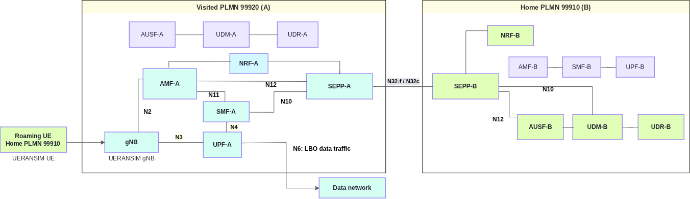

<!-- SPDX-License-Identifier: CC-BY-4.0 -->

<table style="border-collapse: collapse; border: none;">
  <tr style="border-collapse: collapse; border: none;">
    <td style="border-collapse: collapse; border: none;">
      <a href="http://www.openairinterface.org/">
         
         </img>
      </a>
    </td>
    <td style="border-collapse: collapse; border: none; vertical-align: center;">
      <b><font size = "5">OpenAirInterface 5G Core Network Local Breakout Roaming Deployment using Docker Compose</font></b>
    </td>
  </tr>
</table>

# Local Breakout Roaming

This tutorial illustrates the **Local Breakout (LBO) roaming** case: a UE from the **home PLMN 999/10** connects to the **visited PLMN 999/20**, and its PDU session is served and broken out in the visited network. It covers the 5G roaming signalling and user-plane procedures of an LBO connection (3GPP TS 23.501 clause 4.2.4, 3GPP TS 23.502 clause 4.3.2.2.1):

- **Inter-PLMN communication through the SEPPs** over N32 (3GPP TS 29.573).
- **UE authentication and subscription retrieval from the home network**: the visited AMF discovers the home AUSF and UDM through the NRFs and the SEPPs.
- **PDU session establishment in the visited network**: the visited SMF allocates the UE address, and the visited UPF carries the traffic to the data network on N6.

The RAN is simulated: [UERANSIM](https://github.com/aligungr/UERANSIM) provides both the gNB of the visited PLMN and the roaming UE, built from a [fork with roaming PLMN selection](https://github.com/rohanrkharade/UERANSIM) (section 2). No radio hardware is needed.



The [home routed roaming tutorial](./DEPLOY_SA5G_HR_ROAMING.md) uses the same two networks, SEPPs and subscriber, with the PDU session anchored in the home network instead.

## At A Glance

| Item | Value |
| ---- | ----- |
| Goal | Register a roaming UE in the visited PLMN and validate LBO user-plane traffic |
| Home → visited PLMN | 999/10 → 999/20 |
| RAN and UE | Simulated with UERANSIM: gNB in PLMN 999/20, UE `imsi-999100000000031` from PLMN 999/10 |
| UE subscription | `imsi-999100000000031`, DNN `oai`, S-NSSAI SST 222 / SD 00007B |
| Home subscription | `lboRoamingAllowed: true` for DNN `oai` in 999/20 |
| UE address pool | `12.1.1.128/25` (visited SMF) |
| Working directory | `oai-cn5g-fed/docker-compose` |
| Core compose file | `docker-compose-basic-nrf-lbo-roaming.yaml` |
| Partner configurations | `conf/roaming/roaming_config_partnerA.yaml` (visited), `conf/roaming/roaming_config_partnerB.yaml` (home) |
| UERANSIM configuration | `conf/roaming/ueransim/gnb-plmnA.yaml`, `conf/roaming/ueransim/ue-plmnB.yaml` |
| Subscription databases | `database/roaming/oai_roaming_db_A.sql`, `database/roaming/oai_roaming_db_B.sql` |
| Image build helper | `build_roaming_images.sh` |
| Result folder used below | `/tmp/oai/lbo-roaming` |

**Reading time**: ~20 minutes

**Replication time**: ~3-4 hours, mostly building the roaming images; ~15 minutes once the images exist.

**Compute resource recommendation**: ~8 GB RAM and 4 CPUs to build the images; ~4 GB RAM to run the scenario.

**TABLE OF CONTENTS**

1. [Pre-Requisites](#1-pre-requisites)
2. [Build Required NF Images](#2-build-required-nf-images)
3. [Deploy The Two PLMNs](#3-deploy-the-two-plmns)
4. [Run And Verify](#4-run-and-verify)
5. [Logs And LBO Test Capture](#5-logs-and-lbo-test-capture)
6. [Cleanup](#6-cleanup)
7. [Troubleshooting](#7-troubleshooting)
8. [Report An Issue](#8-report-an-issue)

## 1. Pre-Requisites

Complete the [deployment pre-requisites](./DEPLOY_PRE_REQUISITES.md) before starting. This lab also needs Git, the Docker `buildx` plugin (BuildKit) for the image build helper, and Python 3 with PyYAML for the capture and log helpers; the helpers stop with an installation hint if one is missing. The commands below use `docker-compose`; replace it with `docker compose` if your host only has Compose v2.

All commands below run from the `docker-compose` folder. Create the result folder:

``` shell
docker-compose-host $: rm -rf /tmp/oai/lbo-roaming && mkdir -p /tmp/oai/lbo-roaming && chmod 777 /tmp/oai/lbo-roaming
```

The certificates under `conf/roaming/certs` are lab fixtures for the N32 connection between the SEPPs. Do not use them outside this lab.

## 2. Build Required NF Images

Only the components with roaming changes not yet in `develop` are built. AUSF and UPF have no roaming changes: no need to build them, the compose file uses the official `oaisoftwarealliance/oai-ausf:develop` and `oaisoftwarealliance/oai-upf:develop` images from Docker Hub.

| Component | Branch | Image |
| --------- | ------ | ----- |
| NRF, UDR, UDM, AMF, SMF | `lbo-roaming-support` branch | `oai-<nf>:roaming-lbo` |
| SEPP | `entrypoint-runtime-config` branch (no Docker Hub image) | `oai-sepp:roaming-lbo` |
| UERANSIM | [UERANSIM with roaming PLMN selection](https://github.com/rohanrkharade/UERANSIM) | `ueransim:roaming-lbo` |

The [build helper](../docker-compose/build_roaming_images.sh) pulls the Docker Hub images, checks that every branch exists, builds the network functions and then UERANSIM, and writes a manifest of the built commits under `.roaming-build/` at the repository root:

``` shell
docker-compose-host $: ./build_roaming_images.sh
```

To see the selection without building, run it with `--plan`, or with `--check` to also verify that every branch exists.

On a host with limited free memory, limit the parallel compilation, e.g. to four CPUs, with `BUILD_CPUSET=0-3 ./build_roaming_images.sh`. The helper then uses a dedicated BuildKit builder pinned to those CPUs. An image that was already built from the same commit is reused.

## 3. Deploy The Two PLMNs

The scenario uses three Docker networks:

| Network | Bridge | Subnet | Used by |
| ------- | ------ | ------ | ------- |
| `oai-public-netA` | `cn5g-partnerA` | `192.168.71.0/24` | Visited PLMN 999/20: NFs, gNB and UE |
| `oai-public-roam` | `cn5g-roam` | `192.168.72.0/24` | N32 between the visited and home SEPPs (inter-PLMN) |
| `oai-public-netB` | `cn5g-partnerB` | `192.168.73.0/24` | Home PLMN 999/10: NFs |

**Step 1: start the capture and deploy.** The [capture helper](../docker-compose/capture_roaming_pcap.py) waits for the three bridges to appear, captures on them for 240 seconds and merges the traffic into one pcap file. It runs `tcpdump` from the NRF image of the scenario on the host network, so no host `tcpdump` is needed:

``` shell
docker-compose-host $: python3 capture_roaming_pcap.py --compose docker-compose-basic-nrf-lbo-roaming.yaml --output /tmp/oai/lbo-roaming/lbo-roaming.pcap > /tmp/oai/lbo-roaming/pcap.log 2>&1 &
docker-compose-host $: docker-compose -f docker-compose-basic-nrf-lbo-roaming.yaml up -d
```

**Step 2: check that all NFs are healthy** before running the UE test of section 4. Repeat the command until every NF shows `Up (healthy)`; MySQL and the UE container show `Up`:

``` shell
docker-compose-host $: docker-compose -f docker-compose-basic-nrf-lbo-roaming.yaml ps
```

<!-- excerpt:nf-health -->
```console
Name                                     State
amf.5gc.mnc10.mcc999.3gppnetwork.org     Up (healthy)
amf.5gc.mnc20.mcc999.3gppnetwork.org     Up (healthy)
ausf.5gc.mnc10.mcc999.3gppnetwork.org    Up (healthy)
ausf.5gc.mnc20.mcc999.3gppnetwork.org    Up (healthy)
mysql-A                                  Up
mysql-B                                  Up
nrf.5gc.mnc10.mcc999.3gppnetwork.org     Up (healthy)
nrf.5gc.mnc20.mcc999.3gppnetwork.org     Up (healthy)
sepp.5gc.mnc10.mcc999.3gppnetwork.org    Up (healthy)
sepp.5gc.mnc20.mcc999.3gppnetwork.org    Up (healthy)
smf.5gc.mnc10.mcc999.3gppnetwork.org     Up (healthy)
smf.5gc.mnc20.mcc999.3gppnetwork.org     Up (healthy)
udm.5gc.mnc10.mcc999.3gppnetwork.org     Up (healthy)
udm.5gc.mnc20.mcc999.3gppnetwork.org     Up (healthy)
udr.5gc.mnc10.mcc999.3gppnetwork.org     Up (healthy)
udr.5gc.mnc20.mcc999.3gppnetwork.org     Up (healthy)
ue-plmnB-roaming-A                       Up
upf.5gc.mnc10.mcc999.3gppnetwork.org     Up (healthy)
upf.5gc.mnc20.mcc999.3gppnetwork.org     Up (healthy)
```
<!-- /excerpt -->

Each SEPP has its SBI interface in its own PLMN and its N32 interface on `oai-public-roam`. At start-up, the SEPP container detects which interface is which and runs with a copy of its configuration; the mounted partner configuration is read-only and stays unchanged. The containers of the visited PLMN use the `mnc20` FQDNs and those of the home PLMN the `mnc10` FQDNs.

## 4. Run And Verify

The `ue-plmnB-roaming-A` container waits 50 seconds for the core, starts the visited gNB (PLMN 999/20) and the UE, and pings `google.com` through the UE tunnel interface once the PDU session is up. The UE selects the visited PLMN, registers and establishes its PDU session:

``` shell
docker-compose-host $: docker logs ue-plmnB-roaming-A > /tmp/oai/lbo-roaming/ueransim.log 2>&1
docker-compose-host $: grep -E 'Selected plmn|Registration is successful|establishment is successful|TUN interface' /tmp/oai/lbo-roaming/ueransim.log
```

<!-- excerpt:ue-registration -->
```console
[2026-10-03 11:46:32.751] [nas] [info] Selected plmn[999/20] (home plmn[999/10])
[2026-10-03 11:46:32.907] [nas] [info] Initial Registration is successful
[2026-10-03 11:46:33.278] [nas] [info] PDU Session establishment is successful PSI[1]
[2026-10-03 11:46:33.315] [app] [info] Connection setup for PDU session[1] is successful, TUN interface[uesimtun0, 12.1.1.130] is up.
```
<!-- /excerpt -->

Check the UE state and PDU session with the UERANSIM CLI:

``` shell
docker-compose-host $: SUPI=$(sed -n 's/^supi: //p' conf/roaming/ueransim/ue-plmnB.yaml)
docker-compose-host $: docker exec ue-plmnB-roaming-A nr-cli "$SUPI" -e status
docker-compose-host $: docker exec ue-plmnB-roaming-A nr-cli "$SUPI" -e ps-list
```

<!-- excerpt:ue-status -->
```console
cm-state: CM-CONNECTED
rm-state: RM-REGISTERED
selected-plmn: 999/20
hplmn: 999/10
roaming: true
current-plmn: 999/20
```
<!-- /excerpt -->

<!-- excerpt:ue-ps-list -->
```console
PDU Session1:
 state: PS-ACTIVE
 session-type: IPv4
 apn: oai
 s-nssai:
  sst: 0xde
  sd: 0x00007b
 emergency: false
 address: 12.1.1.130
 ambr: up[100Mb/s] down[100Mb/s]
 data-pending: false
```
<!-- /excerpt -->

Confirm `roaming: true`, an active IPv4 PDU session on DNN `oai`, and a UE address from the visited pool `12.1.1.128/25`. Then generate traffic from the UE tunnel interface:

``` shell
docker-compose-host $: docker exec ue-plmnB-roaming-A ping -c 3 -I uesimtun0 google.com
```

<!-- excerpt:ue-ping -->
```console
PING google.com (108.177.119.138) from 12.1.1.130 uesimtun0: 56(84) bytes of data.
64 bytes from ei-in-f138.1e100.net (108.177.119.138): icmp_seq=1 ttl=104 time=24.7 ms
64 bytes from ei-in-f138.1e100.net (108.177.119.138): icmp_seq=2 ttl=104 time=22.8 ms
64 bytes from ei-in-f138.1e100.net (108.177.119.138): icmp_seq=3 ttl=104 time=21.1 ms

--- google.com ping statistics ---
3 packets transmitted, 3 received, 0% packet loss, time 2001ms
rtt min/avg/max/mdev = 21.139/22.880/24.744/1.474 ms
```
<!-- /excerpt -->

The UE address and the destination address can differ in your run.

## 5. Logs And LBO Test Capture

Collect the logs of every container, including all NFs of both PLMNs:

``` shell
docker-compose-host $: python3 capture_roaming_logs.py --compose docker-compose-basic-nrf-lbo-roaming.yaml --output /tmp/oai/lbo-roaming/logs
```

The packet capture started in section 3 stops by itself after 240 seconds and writes `/tmp/oai/lbo-roaming/lbo-roaming.pcap`. Debug logs and captures contain subscriber authentication material of the lab subscriber; share only redacted excerpts of other subscribers.

Selected excerpts from the same run follow. The Docker timestamp prefix is removed; each line keeps the NF's own timestamp.

**Visited SEPP: N32-c handshake with the home SEPP** (3GPP TS 29.573 clause 5.2). The SEPPs agree on PRINS as N32-f security, then exchange the JWE and JWS ciphers and the N32-f context ID:

<!-- excerpt:sepp-n32-visited -->
```console
[2026-10-03 13:45:33.043] [sepp_app] [info] Creating N32-c capability exchange request via model
[2026-10-03 13:45:33.043] [sepp_app] [info] Initiating N32-c capability exchange with peer SEPP: http://sepp.5gc.mnc10.mcc999.3gppnetwork.org:8080/n32c-handshake/v1/exchange-capability
[2026-10-03 13:45:33.097] [sepp_client] [debug] Send a simple HTTP request
[2026-10-03 13:45:33.109] [sepp_app] [info] Received HTTP response with status code: 200
[2026-10-03 13:45:33.109] [sepp_app] [info] Processing N32-c capability exchange response
[2026-10-03 13:45:33.109] [sepp_app] [info] Capability exchange response from peer SEPP: sepp.5gc.mnc10.mcc999.3gppnetwork.org
[2026-10-03 13:45:33.109] [sepp_app] [info] Peer SEPP confirmed 3GppSbiTargetApiRootSupported: true
[2026-10-03 13:45:33.109] [sepp_app] [info] Selected Security Capability: PRINS
[2026-10-03 13:45:33.109] [sepp_app] [info] N32-c capability exchange succeeded with http://sepp.5gc.mnc10.mcc999.3gppnetwork.org:8080/n32c-handshake/v1/exchange-capability
[2026-10-03 13:45:33.109] [sepp_app] [info] Security capability is PRINS. Performing Parameter Exchange...
[2026-10-03 13:45:33.109] [sepp_app] [info] Creating SecParamExchReqData via OpenAPI model
[2026-10-03 13:45:33.109] [sepp_app] [info] Initiating N32-c parameter exchange with http://sepp.5gc.mnc10.mcc999.3gppnetwork.org:8080/n32c-handshake/v1/exchange-params
[2026-10-03 13:45:33.109] [sepp_client] [debug] Send a simple HTTP request
[2026-10-03 13:45:33.114] [sepp_app] [info] Parameter exchange status code: 200
[2026-10-03 13:45:33.114] [sepp_app] [info] Processing N32-c parameter exchange response using model
[2026-10-03 13:45:33.114] [sepp_app] [info] Context ID established: 7ae41135-f0e1-45d0-b05b-003dc9cc9c01
[2026-10-03 13:45:33.114] [sepp_app] [info] Negotiated JWE cipher: A128GCM
[2026-10-03 13:45:33.114] [sepp_app] [info] Negotiated JWS cipher: ES256
[2026-10-03 13:45:33.114] [sepp_app] [info] N32-c Parameter Exchange successfully established
```
<!-- /excerpt -->

**Home SEPP: the same handshake from the responding side**

<!-- excerpt:sepp-n32-home -->
```console
[2026-10-03 13:45:33.107] [sepp_app] [info] Processing N32-c capability exchange request
[2026-10-03 13:45:33.107] [sepp_app] [info] Peer indicated 3GppSbiTargetApiRootSupported: true
[2026-10-03 13:45:33.107] [sepp_app] [info] Received capability exchange request from peer SEPP: sepp.5gc.mnc20.mcc999.3gppnetwork.org
[2026-10-03 13:45:33.107] [sepp_app] [info] Successfully processed N32-c capability exchange (Selected Security: PRINS, Purpose: ROAMING, TargetApiRoot: true)
[2026-10-03 13:45:33.113] [sepp_app] [info] Handling N32-c parameter exchange request using model
[2026-10-03 13:45:33.113] [sepp_app] [info] Processed N32-c parameter exchange. N32F Context ID: 7ae41135-f0e1-45d0-b05b-003dc9cc9c01, JWE: A128GCM, JWS: ES256
```
<!-- /excerpt -->

**N32-f message protected with JOSE: authentication request of the visited AMF to the home AUSF** (PRINS, 3GPP TS 29.573 clause 5.3, 3GPP TS 33.501 clause 13.2). The visited SEPP receives the `nausf-auth` request of the visited AMF, protects it with the negotiated JWE/JWS ciphers and sends it over N32-f; it decrypts the protected response of the home SEPP before answering the AMF:

<!-- excerpt:sepp-jose-visited -->
```console
[2026-10-03 13:46:32.777] [sepp_app] [info] Forwarding NF service request: authority=ausf.5gc.mnc10.mcc999.3gppnetwork.org:8080, path=/nausf-auth/v1/ue-authentications, method=POST
[2026-10-03 13:46:32.777] [sepp_client] [debug] Send a simple HTTP request
[2026-10-03 13:46:32.830] [sepp_app] [info] PRINS: Received HTTP response status: 200
[2026-10-03 13:46:32.830] [sepp_app] [debug] PRINS: Decrypted JOSE response: {"5gAuthData":{"autn":"89a0d639d5e480008bc4b62e57921c9e","hxresStar":"6497e4713dee30543ee48f4bef4a001d","rand":"be814da9fe7dbb070dd197a0f5e29d3e"},"_links":{"5g-aka":{"href":"http://192.168.73.133:8080/nausf-auth/v1/ue-authentications/89a0d639d5e480008bc4b62e57921c9e/5g-aka-confirmation"}},"authType":"5G_AKA"}
```
<!-- /excerpt -->

The home SEPP decrypts the JOSE payload, sends the request to the home AUSF and protects the response for the way back:

<!-- excerpt:sepp-jose-home -->
```console
[2026-10-03 13:46:32.778] [sepp_app] [info] Decrypted JOSE incoming payload: {"servingNetworkName":"5G:mnc020.mcc999.3gppnetwork.org","supiOrSuci":"imsi-999100000000031"}
[2026-10-03 13:46:32.778] [sepp_app] [info] Sending local HTTP request to target NF: http://ausf.5gc.mnc10.mcc999.3gppnetwork.org:8080/nausf-auth/v1/ue-authentications
[2026-10-03 13:46:32.778] [sepp_app] [info] Prepared local NF HTTP request: HTTP Request to URI: http://ausf.5gc.mnc10.mcc999.3gppnetwork.org:8080/nausf-auth/v1/ue-authentications
[2026-10-03 13:46:32.778] [sepp_client] [debug] Send a simple HTTP request
[2026-10-03 13:46:32.829] [sepp_app] [info] Received local NF HTTP response with status code: 201
```
<!-- /excerpt -->

**Home AUSF: authentication of the roaming UE** (5G AKA, 3GPP TS 33.501 clause 6.1.3.2), main lines:

<!-- excerpt:ausf-auth -->
```console
[2026-10-03 13:46:32.780] [ausf_app] [info] supiOrSuci imsi-999100000000031
[2026-10-03 13:46:32.780] [ausf_app] [info] Received authInfo from AMF without ResynchronizationInfo IE
[2026-10-03 13:46:32.828] [ausf_server] [info] Send Auth response to SEAF (Code 201)
[2026-10-03 13:46:32.838] [ausf_server] [info] Received 5g_aka_confirmation Request
[2026-10-03 13:46:32.838] [ausf_app] [info] Received res* 2A6E1A57CF03A2D42BD89E7AFED66D79
[2026-10-03 13:46:32.838] [ausf_app] [info] Authentication successful by home network!
[2026-10-03 13:46:32.852] [ausf_server] [info] Send 5g-aka-confirmation response to SEAF (Code 200)
```
<!-- /excerpt -->

**Visited AMF: the UE is registered in PLMN 999,20 through the visited gNB**

<!-- excerpt:amf-ues -->
```console
[2026-10-03 13:49:35.716] [amf_app] [info]
   |------------------------------------------------------------------------------------------------------------------------------------------------------------|
   |----------------------------------------------------------------------gNBs' Information---------------------------------------------------------------------|
   |  Index |               Status               |              Global Id             |              gNB Name              |                PLMN                |
   |    1   |              Connected             |                0x01                |        UERANSIM-gnb-999-20-1       |               999,20               |
   |------------------------------------------------------------------------------------------------------------------------------------------------------------|

   |-----------------------------------------------------------------------------------------------------------------------------------------------------------|
   |---------------------------------------------------------------------UEs' Information----------------------------------------------------------------------|
   |  Index |     5GMM State     |                IMSI/SUPI               |        GUTI        |   RAN UE NGAP ID   |   AMF UE NGAP ID   |        PLMN        |       Cell Id      |
   |    1   |   5GMM-REGISTERED  |             999100000000031            |99920010041138844381|        0x01        |        0x01        |       999,20       |      000000010     |
   |-----------------------------------------------------------------------------------------------------------------------------------------------------------|
```
<!-- /excerpt -->

**Visited SMF: PDU session with the UE address from the visited pool**

<!-- excerpt:smf-context -->
```console
[2026-10-03 13:46:33.313] [smf_app] [info] SMF context:

SMF CONTEXT:
SUPI:				imsi-999100000000031
PDU SESSION:
	PDU Session ID:			1
	DNN:			oai
	S-NSSAI:			sst, sd: 222, 00007b
	PDN type:		IPV4
	PAA IPv4:		12.1.1.130
	Default QFI:		No QFI available
	SEID:			1
	N3:
- UPF Graph Edge
  + Interface Type.............................: N3
  + NWI........................................:
  + Uplink.....................................: No
  + PDR ID.....................................: 1
  + FAR ID.....................................: 2


[2026-10-03 13:46:33.313] [smf_app] [debug] Send request to N11 to triger FlexCN, SMF Context ID 0x1
```
<!-- /excerpt -->

**Visited UPF: N4 session modification and forwarding rules** (3GPP TS 29.244). The modification adds the downlink FAR and PDR towards the gNB; the rules table then holds both directions of the session:

<!-- excerpt:upf-visited -->
```console
[2026-10-03 13:46:33.289] [upf_app] [info] ╔═════════════════════════════════════════════════════════════════════════════╗
[2026-10-03 13:46:33.289] [upf_app] [info] │             Received N4_SESSION_MODIFICATION_REQUEST seid 0x1               │
[2026-10-03 13:46:33.289] [upf_app] [info] ╚═════════════════════════════════════════════════════════════════════════════╝
[2026-10-03 13:46:33.289] [upf_n4 ] [info] pfcp_session::add(far) seid 0x1 FAR=2
[2026-10-03 13:46:33.289] [upf_n4 ] [info]   └─ Adding new FAR 2 to session 0x1
[2026-10-03 13:46:33.289] [upf_n4 ] [debug]      • Apply Action: FORW
[2026-10-03 13:46:33.289] [upf_n4 ] [debug]      • Destination Interface: ACCESS
[2026-10-03 13:46:33.289] [upf_n4 ] [debug]      • Outer Header TEID: 0x1
[2026-10-03 13:46:33.289] [upf_n4 ] [debug]      • Remote IP: 192.168.71.140
[2026-10-03 13:46:33.289] [upf_n4 ] [debug]      • Total FARs in session: 2
[2026-10-03 13:46:33.289] [upf_n4 ] [info] pfcp_session::add(pdr) seid 0x1 PDR=2
[2026-10-03 13:46:33.289] [upf_n4 ] [info]   └─ Adding new PDR 2 to session 0x1
[2026-10-03 13:46:33.289] [upf_n4 ] [debug]      • Source Interface: CORE (Downlink)
[2026-10-03 13:46:33.289] [upf_n4 ] [debug]      • UE IP Address: 12.1.1.130
[2026-10-03 13:46:33.289] [upf_n4 ] [debug]      • Precedence: 4294967295
[2026-10-03 13:46:33.289] [upf_n4 ] [debug]      • Linked FAR: 2
[2026-10-03 13:46:33.289] [upf_n4 ] [debug]      • Linked QER: 2
[2026-10-03 13:46:33.289] [upf_n4 ] [debug]      • Total PDRs in session: 2

  ┌───────────────────────────────────────────────────────────────────────────────────────────────────────────────────────────────────────────────────────────────────────────────────────────────┐
  │                                                                                PDU SESSION RULES - Session 0x1                                                                                │
  ├────────┬───────┬───────┬───────┬───────┬───────┬────────────┬───────────┬─────────────────┬────────────┬────────────┬───────┬────────────────────────────────┬────────────────────────────────┤
  │  PDR   │  FAR  │  QER  │  URR  │  BAR  │  MAR  │ Precedence │ Direction │    UE IPv4      │   Action   │  Dest If   │  QFI  │       Create Outer Hdr         │       Remove Outer Hdr         │
  ├────────┼───────┼───────┼───────┼───────┼───────┼────────────┼───────────┼─────────────────┼────────────┼────────────┼───────┼────────────────────────────────┼────────────────────────────────┤
  │ 1      │ 1     │ -     │ -     │ -     │ -     │ 4294967295 │ UL        │ 12.1.1.130      │ FORW       │ CORE       │ -     │ -                              │ GTP TEID:0x1                   │
  │ 2      │ 2     │ -     │ -     │ -     │ -     │ 4294967295 │ DL        │ 12.1.1.130      │ FORW       │ ACCESS     │ -     │ GTP → 192.168.71.140:0x1       │ -                              │
  └────────┴───────┴───────┴───────┴───────┴───────┴────────────┴───────────┴─────────────────┴────────────┴────────────┴───────┴────────────────────────────────┴────────────────────────────────┘
```
<!-- /excerpt -->

The visited UPF removes the N3 GTP-U header of uplink packets and sends them to the data network (`CORE`), and encapsulates downlink packets in GTP-U towards the gNB (`ACCESS`). The home UPF has no session for this UE. In the capture, the GTP-U packets on `cn5g-partnerA` between the gNB (`192.168.71.140`) and the visited UPF (`192.168.71.139`) carry the UE traffic on N3, and the ICMP packets leaving the visited UPF carry it on N6; the requests of the visited NFs to the home NFs cross `cn5g-roam` between the SEPPs.

The complete logs and the capture of this run:

| Artifact | Visited PLMN 999/20 | Home PLMN 999/10 |
| -------- | ------------------- | ---------------- |
| AMF | [amf-visited.log](./results/roaming/lbo/amf-visited.log) | [amf-home.log](./results/roaming/lbo/amf-home.log) |
| SMF | [smf-visited.log](./results/roaming/lbo/smf-visited.log) | [smf-home.log](./results/roaming/lbo/smf-home.log) |
| UPF | [upf-visited.log](./results/roaming/lbo/upf-visited.log) | [upf-home.log](./results/roaming/lbo/upf-home.log) |
| NRF | [nrf-visited.log](./results/roaming/lbo/nrf-visited.log) | [nrf-home.log](./results/roaming/lbo/nrf-home.log) |
| AUSF | [ausf-visited.log](./results/roaming/lbo/ausf-visited.log) | [ausf-home.log](./results/roaming/lbo/ausf-home.log) |
| UDM | [udm-visited.log](./results/roaming/lbo/udm-visited.log) | [udm-home.log](./results/roaming/lbo/udm-home.log) |
| UDR | [udr-visited.log](./results/roaming/lbo/udr-visited.log) | [udr-home.log](./results/roaming/lbo/udr-home.log) |
| SEPP | [sepp-visited.log](./results/roaming/lbo/sepp-visited.log) | [sepp-home.log](./results/roaming/lbo/sepp-home.log) |
| Roaming UE | [ueransim.log](./results/roaming/lbo/ueransim.log), [ue-test.log](./results/roaming/lbo/ue-test.log) | - |
| Packet capture | [lbo-roaming.pcap](./results/roaming/lbo/lbo-roaming.pcap) | both PLMNs |

## 6. Cleanup

``` shell
docker-compose-host $: docker-compose -f docker-compose-basic-nrf-lbo-roaming.yaml down -t 5
```

This keeps the MySQL volumes `oai-lbo-mysql-a` and `oai-lbo-mysql-b`. Remove them with `docker volume rm oai-lbo-mysql-a oai-lbo-mysql-b` to reload the subscriber databases on the next deployment. Stop this scenario before deploying the [home routed roaming scenario](./DEPLOY_SA5G_HR_ROAMING.md), because both use the same container and network names.

## 7. Troubleshooting

| Symptom | First check |
| ------- | ----------- |
| A SEPP is not healthy or N32-c is not established | `docker logs` of both SEPPs: the detected NBI/SBI interfaces and the N32-c handshake |
| UE log shows `Initial Registration failed [FIVEG_SERVICES_NOT_ALLOWED]` | The visited AMF could not reach the home UDM: check that the home NRF lists `nudm-sdm` for the home UDM (`docker logs` of the home NRF) and that the UDM image was built from `lbo-roaming-support` |
| UE log shows authentication failures | Check the home AUSF and UDM logs and both SEPP logs for the forwarded requests |
| UE address is not from `12.1.1.128/25` | Check `lboRoamingAllowed` for DNN `oai` in `database/roaming/oai_roaming_db_B.sql` and that the MySQL volumes were reloaded |
| No traffic through `uesimtun0` | Check the visited UPF rules in section 5 and IPv4 forwarding on the host |

## 8. Report An Issue

When opening an issue, include:

1. The image manifest written by `build_roaming_images.sh` under `.roaming-build/runs/`.
2. The logs collected in section 5.
3. The packet capture from section 3, if possible.
4. Any change to the partner configurations or databases.

For contribution workflow details, see [CONTRIBUTING.md](../CONTRIBUTING.md).
