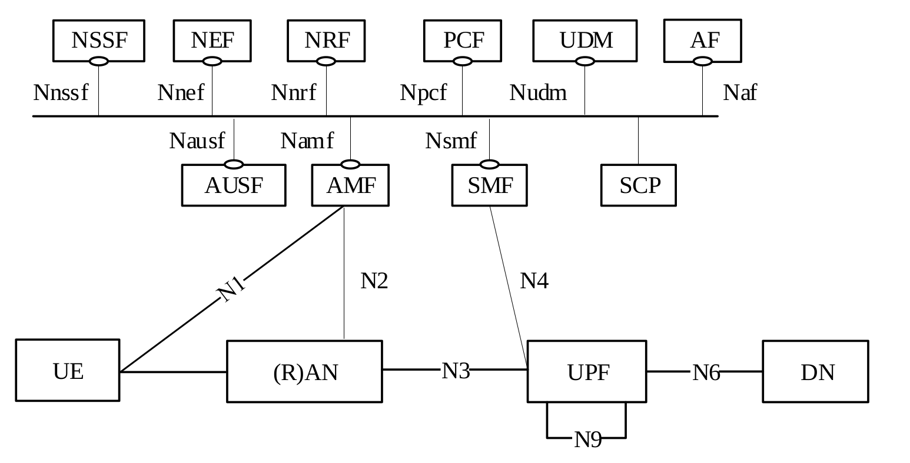
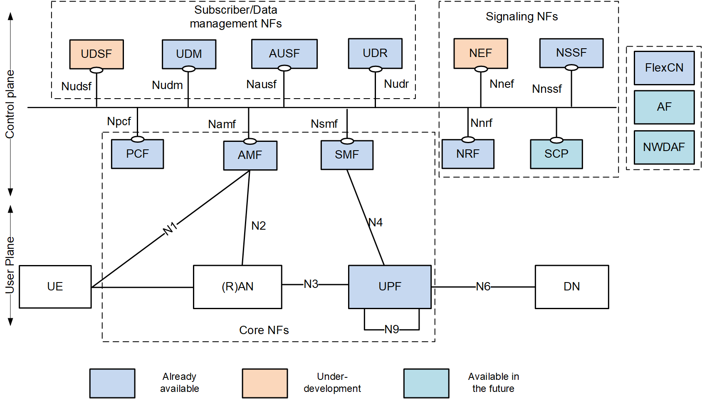

# OpenAirInterface Policy Control Function (PCF) Feature Set

[[_TOC_]]

## 1. 5GC Service Based Architecture

## 2. OAI PCF Available Interfaces

| **ID** | **Interface** | **Status** | **Comment** |
|--------|---------------|------------|-------------|
| 1 | N7 (*) (**) | ✅ | between PCF and SMF |
| 2 | N5 | ❌ | between PCF and AF |
| 3 | N15 | ❌ | between PCF and AMF |
| 4 | N24 | ❌ | between V-PCF and H-PCF |
| 5 | N36 | ❌ | between PCF and UDR |

> (*): support both HTTP/1.1 and HTTP/2  
> (**): UpdateNotify feature not supported

## 3. OAI PCF Feature List

Based on documents **3GPP TS 23.501 v16.0.0 (Section 6.2.4)** and **3GPP TS 23.503 v16.0.0 (Section 6.2.1)**

| **ID** | **Classification**                                                   | **Status** | **Comments** |
|--------|----------------------------------------------------------------------|------------|--------------|
| 1  | Policy and charging control for a service data flows                 | ❌ | |
| 2  | PDU Session related policy control                                   | ✅ | Except UpdateNotify feature |
| 3  | PDU Session event reporting to the AF                                | ❌ | |
| 4  | Access and mobility related policy control                           | ❌ | |
| 5  | UE access selection and PDU Session selection related policy control | ❌ | |
| 6  | Negotiation for future background data transfer                      | ❌ | |
| 7  | Usage monitoring                                                     | ❌ | |
| 8  | Sponsored data connectivity                                          | ❌ | |
| 9  | Input for PCC decisions                                              | ❌ | Currently only local rules |
| 10 | Policy control subscription information management                   | ❌ | |
| 11 | V-PCF                                                                | ❌ | |
| 12 | H-PCF                                                                | ❌ | |
| 13 | Application specific policy information management                   | ❌ | |
| 14 | NRF NF Registration                                                  | ✅ | |
