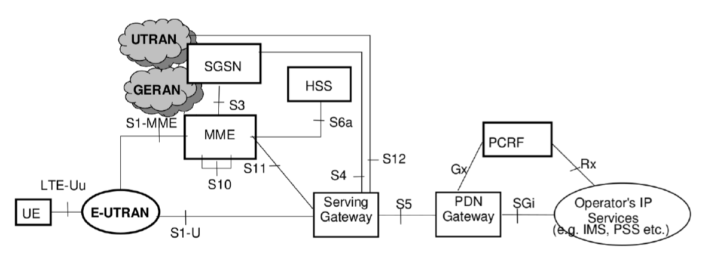

# OpenAirInterface Core Network Feature Set

[[_TOC_]]

## 1. OpenAirInterface Core Network Block Diagram

## 2. OAI Core Network Fundamentals

* Network Access Control Functions
  - Authentication and authorization
  - Admission control
  - Policy and charging enforcement
* Packet Routing and Transfer Functions
  - IP header compression function
  - Packet screening
* Mobility Management Functions
  - Reachability management for UE in ECM IDLE state
* Security Functions
* Radio Resource Management Functions
* Network Management Functions (O&M)
  - `GTP` C signaling based Load and Overload Control
  - Load balancing between `MME` instances
  - `MME` control of overload
  - PDN Gateway control of overload

## 3. OAI Core Network Deployment

* Target OS
  - Ubuntu 18.04 (bionic) server edition
  - Red Hat Enterprise Linux 9
* Hardware Requirements
  - x86-64 Intel/AMD CPU
  - At least one network device
* Linux Kernel
  - Generic kernel is enough
* Deployment feasible on:
  - PC
  - Server
  - Container
  - Virtual Machine

> **We strongly recommend a container-based deployment (either in a `docker-compose` fashion, or in a `Kubernetes`-like cluster).**

## 4. OAI SPGW-CUPS Fundamentals

CUPS = Control-User Planes Separation

So SPGW is composed of almost 2 network functions:

* 1 SPGW-C
* 1 User Plane Function (UPF)

Multiple instances of `UPF` may be connected to a single instance of `SPGW-C`.

Fully written in C++ (`-std=c++17`)

* Internal design still asynchronous (ITTI based API)
* Usage of submodules: spdlog, libfolly (nolock collections)

Main differences with previous SPGW (tag `v0.7.0`)

* Handles `GTP` fragmentation
* Enables Network Address Translation (`NAT`), based on iptables
* Easier to install (no kernel dependencies)
* Switch-talking natively `PFCP`
* Data is copied/handled in user space
